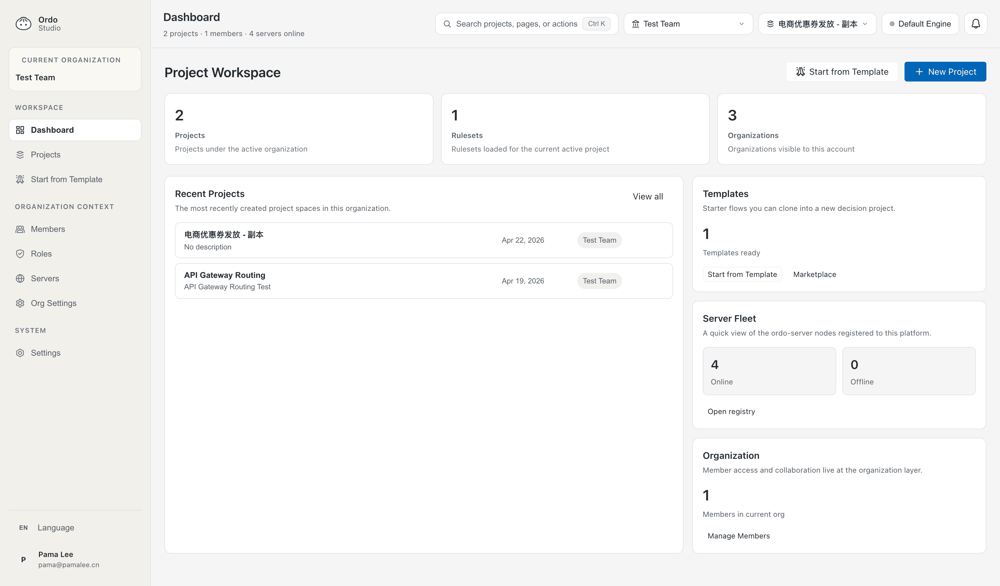

<p align="center">
  
</p>

<h1 align="center">Ordo</h1>

<p align="center">
  <strong>The deterministic decision layer for AI agents — the LLM proposes, your rules dispose.</strong>
</p>

<p align="center">
  A sub-microsecond, JIT-compiled rule engine in Rust. Give your AI agent guardrails you can <em>test</em>.
</p>

<p align="center">
  <a href="https://ordo-engine.github.io/Ordo/"></a>
  
  
  <a href="https://www.npmjs.com/package/@ordo-engine/cli"></a>
  <a href="https://discord.gg/Y529FkArhh"></a>
</p>

<p align="center">
  
</p>

---

An LLM is non-deterministic: ask it the same thing twice and you can get two answers. That's fine for drafting prose and dangerous the moment an agent touches money, data, or a shell. Ordo is the layer that decides — **allow / deny / ask** — deterministically, from rules that are versioned, tested, and auditable. The agent proposes the action; Ordo disposes.

## Guard your coding agent in 5 minutes

The sharpest place to feel this today: put deterministic guardrails on a coding agent. `ordo guard` hooks into **Claude Code, Codex CLI, and Cursor** and runs every tool call through the same local policy.

```bash
npx @ordo-engine/cli guard init                        # Claude Code (default)
npx @ordo-engine/cli guard init --agent codex,cursor    # …and/or Codex CLI, Cursor
```

Now your agent is gated. When it reaches for something destructive, Ordo stops it — with a reason:

```text
$ (agent tries) rm -rf ./build
⛔ Denied by policy: Destructive shell command blocked by policy [policy@1.0.0 · DENY]
```

The policy is a **normal Ordo project** in `.ordo-guard/` — so your guardrails have a test suite:

```bash
ordo guard test      # ✔ blocks rm -rf  ✔ asks before git push  ✔ allows read-only git …
ordo guard log       # every decision, timestamped and auditable
```

Edit `.ordo-guard/rulesets/policy.json` in plain expressions (`tool == 'Bash' && command contains 'terraform destroy'`), add a test, ship. → **[Guard docs](https://ordo-engine.github.io/Ordo/docs/en/platform/guard)**

---

## The same engine, everywhere decisions happen

Guardrails are one use of one engine. The same rules — sub-microsecond, JIT-compiled — run as an embedded call, an HTTP/gRPC service, or in the browser via WASM, and a full **platform + visual Studio** lets business teams author and govern them without touching code.

**Engine** — sub-microsecond rule execution, JIT-compiled (Cranelift), runs everywhere (HTTP · gRPC · WASM · CLI).  
**Studio** — visual flow editor, decision-table editor, trace-driven testing, version history.  
**Platform** — org workspace, project hub, server fleet, release center, testing and governance.

<p align="center">
  
</p>

---

## Why Ordo?

| | **Ordo** | OPA | Drools | json-rules-engine |
|---|---|---|---|---|
| JIT compilation | ✅ Cranelift | ❌ | ❌ | ❌ |
| Testable agent guardrails | ✅ `ordo guard` | ⚠️ policy-only | ❌ | ❌ |
| Authoring model | Visual flow + decision table | Rego policy code | DRL / DMN + Business Central | JSON rule DSL |
| Built-in web workbench | ✅ Studio | Playground / APIs | ✅ Business Central | ❌ |
| Browser / Wasm target | ✅ Native | ✅ Policy-to-Wasm | ❌ | ✅ Browser JS |
| Deployment | Single binary or hosted platform | Binary, sidecar, or service | JVM app, KIE Server, Business Central | JS library for Node/browser |

Comparison focuses on first-party documented authoring and deployment capabilities rather than cross-project benchmark claims.

---

## More ways to run it

### Author rules as files (local, offline)

```bash
npx @ordo-engine/cli init my-rules && cd my-rules
ordo validate && ordo test           # sub-second, no network
ordo trace loan-approval --input '{"amount":5000}'
```

### Try Studio (visual, 5 minutes)

```bash
docker compose up          # platform + engine + studio
# open http://localhost:5173
```

Or use the hosted **[Live Playground](https://ordo-engine.github.io/Ordo/)** — no install needed.

### Engine as a service

```bash
docker run -d -p 8080:8080 ghcr.io/pama-lee/ordo:latest

# Create a rule
curl -X POST http://localhost:8080/api/v1/rulesets \
  -H "Content-Type: application/json" \
  -d @examples/discount.json

# Execute
curl -X POST http://localhost:8080/api/v1/rulesets/discount/execute \
  -d '{"input": {"user": {"vip": true}}}'
# → {"code": "VIP", "message": "20% discount"}
```

### Embed the editor

```bash
npm install @ordo-engine/editor-vue    # Vue 3
npm install @ordo-engine/editor-react  # React
```

### Call from your app

```bash
go get github.com/pama-lee/ordo-go     # Go
pip install ordo-sdk                    # Python
# Java (Maven): com.ordoengine:ordo-sdk-java
```

---

## Platform Features

### Rule Authoring
- **Flow editor** — drag-and-drop decision trees with live WASM execution
- **Decision table** — spreadsheet-style multi-condition rules
- **Templates** — ship pre-built rule sets (e.g. `ecommerce-coupon`) that teams clone in one click

### Platform Workspace
- **Organization and project hub** — manage orgs, projects, members, roles, and project workspaces from one dashboard
- **Server fleet** — register connected Ordo servers, group them by environment, and target release rollouts by instance
- **Release center** — create release requests, track staged rollouts, approvals, retries, and rollback history

### Governance
- **Fact catalog** — register every input field with type, source, latency, and null policy
- **Decision contracts** — typed input/output schemas per ruleset; generate test skeletons automatically
- **Version history** — full snapshot log per ruleset; roll back with one click
- **Test and diagnostics** — run platform-local draft tests, inspect expected/actual diffs, replay execution paths, and review decision-table hits

### Engine
- **1.63 µs** interpreter · **50–80 ns** JIT (Cranelift) · **54k QPS** HTTP single-thread
- Multi-tenancy, WAL crash recovery, hot reload, NATS JetStream sync
- Data Filter API — push rule logic into SQL / MongoDB `$match` / JSON predicates
- Compiled `.ordo` binary format with ED25519 signature for rule protection

---

## Project Structure

```
ordo/
├── crates/
│   ├── ordo-core/       # Rule engine + JIT compiler
│   ├── ordo-server/     # HTTP/gRPC API server
│   ├── ordo-platform/   # Org/project/template/testing management layer
│   ├── ordo-cli/        # CLI — guard, init, validate, test, trace, mcp
│   ├── ordo-wasm/       # WebAssembly bindings
│   ├── ordo-proto/      # gRPC definitions
│   └── ordo-derive/     # TypedContext derive macro
├── ordo-editor/
│   ├── packages/        # @ordo-engine/editor-{core,vue,react,wasm}
│   └── apps/
│       ├── studio/      # Platform Studio (Vue 3 + TDesign)
│       ├── playground/  # Live demo
│       └── docs/        # VitePress documentation
├── sdk/                 # Official Go / Python / Java client SDKs
└── scripts/             # sync-version.sh, benchmarks
```

---

## License

MIT — see [LICENSE](LICENSE).

<p align="center"><sub>Built with Rust · <a href="https://discord.gg/Y529FkArhh">Discord</a> · <a href="https://ordo-engine.github.io/Ordo/">Docs</a></sub></p>
