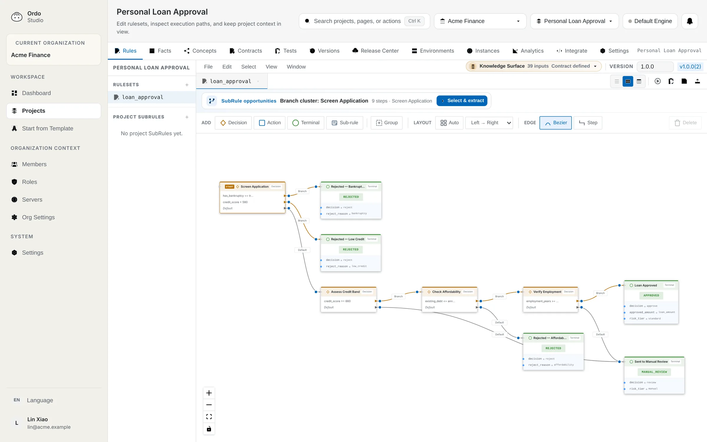
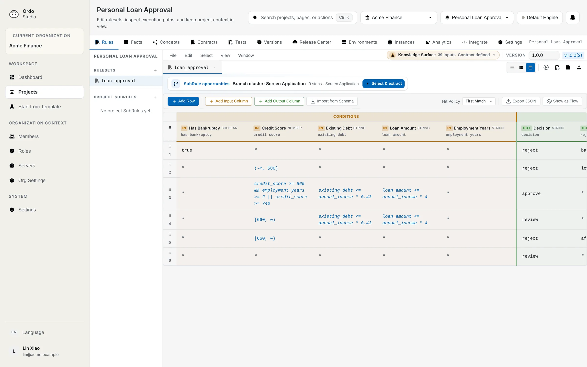
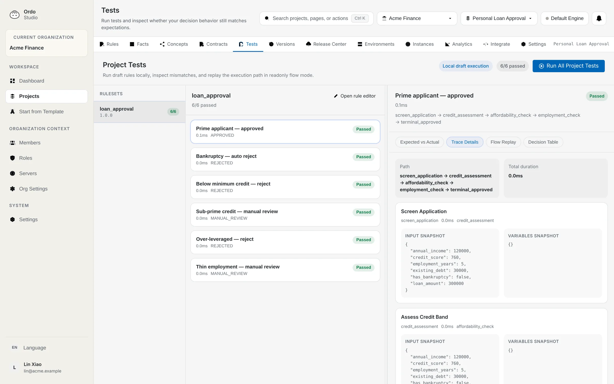

<p align="center">
  
</p>

<h1 align="center">Ordo</h1>

<p align="center">
  <strong>Take business rules out of your code.</strong>
</p>

<p align="center">
  An open-source business rule engine. Pricing, risk and approval logic lives in rule files with tests and versions.<br />
  See which decisions a change moves before you ship it. People can write the rules, and so can AI.
</p>

<p align="center">
  <a href="https://docs.ordoengine.com/en/"></a>
  <a href="https://www.npmjs.com/package/@ordo-engine/cli"></a>
  
  
  <a href="https://discord.gg/Y529FkArhh"></a>
</p>

<p align="center">
  English · <a href="README.zh.md">简体中文</a> · <a href="https://ordoengine.com/en/">Website</a> · <a href="https://docs.ordoengine.com/en/guide/quick-start">Quick start</a>
</p>

<p align="center">
  
</p>

---

Discounts, credit limits and risk thresholds usually end up as if/else branches spread across dozens of files. Moving one number means a release, and nobody can say for sure what the policy is today. Now that AI writes a lot of that code, the branches grow faster than anyone can review them.

Ordo keeps those decisions in their own rule files:

- Rules are JSON or YAML, in git next to your code. You can review them and diff them.
- The expression language is bounded: no loops, no side effects. Rules written by people and rules written by AI can both be checked.
- Money is exact decimal. Inputs are declared with types, and bad input is rejected before any rule runs.
- Every ruleset carries its own tests. `ordo test` runs them locally and in CI, with no server.
- Your application asks one question, such as "what discount does this order get?", and stays the same when the rules change.

## Try a rule pack

```bash
npm i -g @ordo-engine/cli
git clone https://github.com/Ordo-Engine/Ordo
cd Ordo/examples/rule-packs/fraud-scoring

ordo test
ordo trace fraud-scoring --input '{"amount":"6000","account_age_days":400,
  "ip_country":"SG","card_country":"US","new_device":true}'
```

```text
code:    CHALLENGE
message: Ask for 3-D Secure or OTP
output:  {
  "score": 65,
  "signals": [
    "large_amount",
    "new_device",
    "country_mismatch"
  ]
}

path:    blocklist -> signals -> score -> band -> challenge
```

`trace` lists every step a run took and the values along the way, so "why was this payment challenged?" has an answer.

## See what a change affects

Passing tests are not enough. Say the risk team wants to block from a score of 65 instead of 70. After the edit, all 9 tests still pass. `ordo impact` runs the edit next to the last commit, over the test cases, real inputs you provide and probe inputs on both sides of every threshold:

```text
$ ordo impact fraud-scoring
impact fraud-scoring  (HEAD → working tree)
  130 inputs: 9 tests, 0 captured, 121 boundary probes

  CHALLENGE → BLOCK  5 inputs

CHANGED probe:amount=5000  {"account_age_days":400,"amount":5000,
        "card_country":"US","ip_country":"SG","new_device":true}
    code: CHALLENGE → BLOCK
    message: "Ask for 3-D Secure or OTP" → "High risk"
…
5 changed · 125 unchanged
```

One of those five is a long-standing customer paying 5000 from abroad on a new phone. The tests did not cover it, and impact found it before the merge. Add `--fail-on-change` to stop surprise changes in CI, or `--json` to feed the result to other tools. Coding agents get the same check through `ordo mcp`, so an agent can look at the effect of its own rule edit before a person reviews it.

`ordo impact` needs CLI 0.7.0 or later ([release](https://github.com/Ordo-Engine/Ordo/releases/tag/cli-v0.7.0)). See the [CLI docs](https://docs.ordoengine.com/en/platform/cli).

## Rule packs

Common business decisions, already written and tested. Copy one and change the numbers to your own policy.

| pack | decides |
|------|---------|
| [credit-approval](examples/rule-packs/credit-approval) | approve, send to manual review, or decline a personal loan |
| [promo-stacking](examples/rule-packs/promo-stacking) | which promotions apply at checkout, how far they stack, and what the customer pays |
| [fraud-scoring](examples/rule-packs/fraud-scoring) | allow, challenge or block a card payment |

A rule pack is a plain Ordo project. Rules your team writes can be shared the same way.

## Run the rules where the decision is made

```bash
# ordo-server, over HTTP or gRPC
docker run -p 8080:8080 ghcr.io/ordo-engine/ordo:latest
curl -X POST localhost:8080/api/v1/execute/<ruleset> -d '{"input": {...}}'

# Embedded in a Rust program
cargo add ordo-core --git https://github.com/Ordo-Engine/Ordo

# In the browser, as WASM
npm install @ordo-engine/wasm

# From your services
go get github.com/pama-lee/ordo-go     # Go
pip install ordo-sdk                    # Python
# Java (Maven): com.ordoengine:ordo-sdk-java
```

The engine is written in Rust: a bytecode VM, plus a Cranelift JIT for hot numeric expressions. A rule run takes 1.63 µs on the VM, numeric expressions take 50–80 ns after JIT, and a single HTTP thread serves about 54k QPS. See the [benchmarks](https://ordoengine.com/en/benchmarks).

## Studio

Studio draws the same rules as a flow and as a decision table, so people who don't write code can read the logic, run tests and request releases. Engineers keep working with files and git, and the CLI pushes and pulls between the two.

<table>
  <tr>
    <td width="50%"></td>
    <td width="50%"></td>
  </tr>
</table>

- One ruleset, shown as a flow or as a decision table
- Run tests in Studio and compare expected and actual results
- Field catalog, decision contracts, version history and release approvals

See the [Studio docs](https://docs.ordoengine.com/en/platform/studio).

## Ordo Guard

The same engine also keeps coding agents in bounds. Before Claude Code, Codex CLI or Cursor runs a command, it goes through your local rules: allow, deny, or ask you first.

```bash
npx @ordo-engine/cli guard init
```

The policy is an Ordo project in `.ordo-guard/`, with tests (`ordo guard test`) and a log (`ordo guard log`). See the [Guard docs](https://docs.ordoengine.com/en/platform/guard).

<p align="center">
  
</p>

## Compared with other engines

| | **Ordo** | OPA | Drools | json-rules-engine |
|---|---|---|---|---|
| JIT compilation | ✅ Cranelift | ❌ | ❌ | ❌ |
| Authoring model | Rule files (JSON/YAML), visual flow and decision table | Rego policy code | DRL / DMN + Business Central | JSON rule DSL |
| Built-in web workbench | ✅ Studio | Playground / APIs | ✅ Business Central | ❌ |
| Browser / Wasm target | ✅ Native | ✅ Policy-to-Wasm | ❌ | ✅ Browser JS |
| Deployment | Single binary or hosted platform | Binary, sidecar, or service | JVM app, KIE Server, Business Central | JS library for Node/browser |

The comparison covers first-party documented authoring and deployment capabilities, not cross-project benchmark claims.

## Project structure

```
ordo/
├── crates/
│   ├── ordo-core/       # Rule engine, bytecode VM, JIT compiler
│   ├── ordo-server/     # HTTP / gRPC API server
│   ├── ordo-platform/   # Orgs, projects, releases, testing
│   ├── ordo-cli/        # CLI: init, validate, test, trace, impact, mcp, guard
│   ├── ordo-wasm/       # WebAssembly bindings
│   ├── ordo-proto/      # gRPC definitions
│   └── ordo-derive/     # TypedContext derive macro
├── ordo-editor/
│   ├── packages/        # @ordo-engine/editor-{core,vue,react,wasm}
│   └── apps/
│       ├── studio/      # Studio (Vue 3 + TDesign)
│       ├── playground/  # Live demo
│       └── docs/        # Documentation site
├── examples/
│   └── rule-packs/      # credit-approval, promo-stacking, fraud-scoring
└── sdk/                 # Go / Python / Java clients
```

## License

MIT. See [LICENSE](LICENSE).

<p align="center"><sub><a href="https://ordoengine.com/en/">Website</a> · <a href="https://docs.ordoengine.com/en/">Docs</a> · <a href="https://discord.gg/Y529FkArhh">Discord</a></sub></p>
