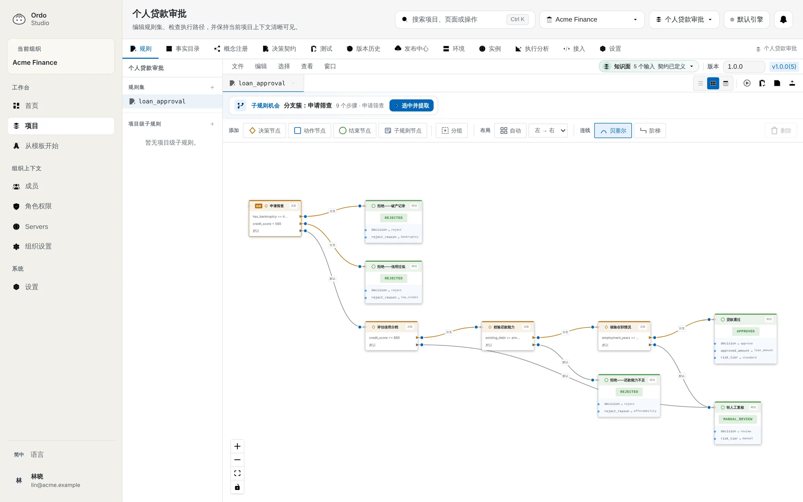
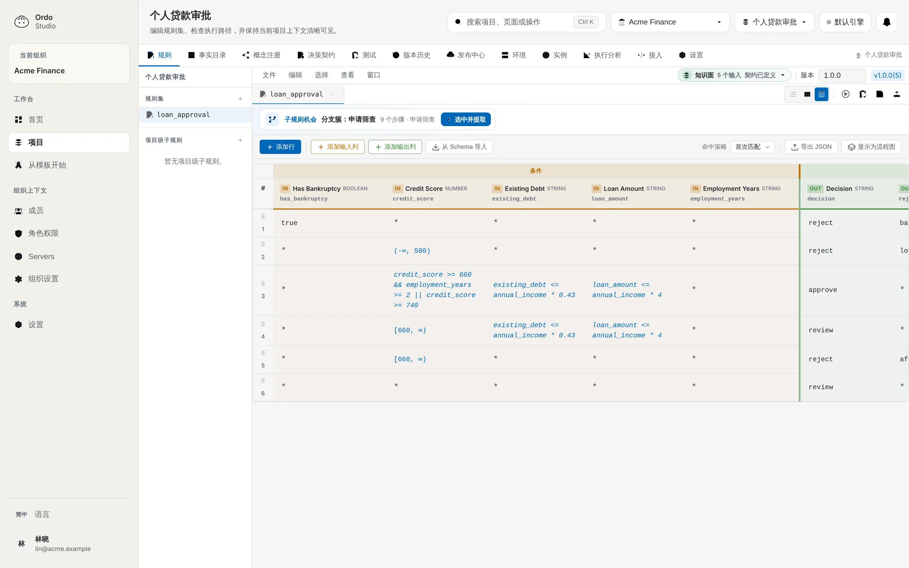
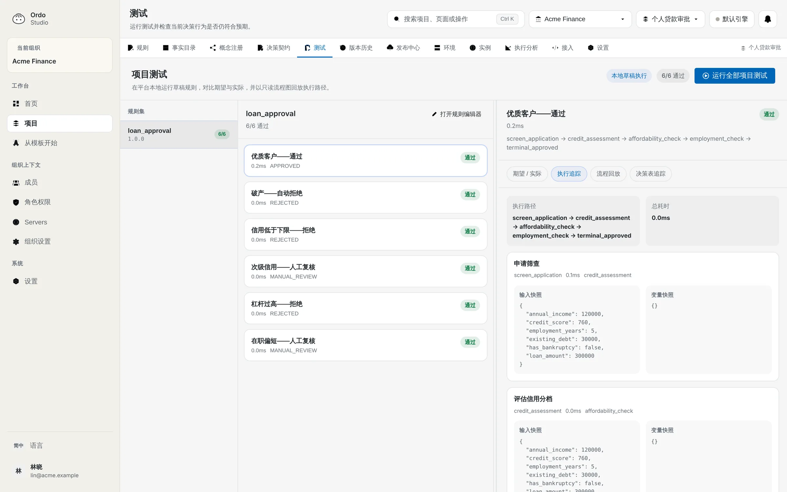

<p align="center">
  
</p>

<h1 align="center">Ordo</h1>

<p align="center">
  <strong>把业务规则从代码里拿出来。</strong>
</p>

<p align="center">
  开源业务规则引擎。定价、风控、审批这类常改的判断，写成带测试、带版本的规则文件。<br />
  改之前先看会影响哪些决策。人能写，AI 也能写。
</p>

<p align="center">
  <a href="https://docs.ordoengine.com/zh/"></a>
  <a href="https://www.npmjs.com/package/@ordo-engine/cli"></a>
  
  
  <a href="https://discord.gg/Y529FkArhh"></a>
</p>

<p align="center">
  <a href="README.md">English</a> · 简体中文 · <a href="https://ordoengine.com/">官网</a> · <a href="https://docs.ordoengine.com/zh/guide/quick-start">快速上手</a>
</p>

<p align="center">
  
</p>

---

折扣、额度、风控阈值，通常是散在几十个文件里的 if/else。调一个数字要发一次版，也没人说得清现在执行的政策到底是什么。现在很多这类代码是 AI 写的，分支长得比人 review 得还快。

Ordo 把这些判断放进单独的规则文件：

- 规则是 JSON 或 YAML，和代码一起进 git，可以 review，可以 diff。
- 表达式语言有边界：没有循环，不能改外部状态。人写的规则和 AI 写的规则都能被校验。
- 金额用 decimal 精确计算。输入字段先声明类型，传错了在规则执行之前就会被拒绝。
- 每个规则集带自己的测试。`ordo test` 在本地和 CI 里都能跑，不需要启动服务。
- 业务代码只需要问一句“这笔订单打几折”，规则怎么变，这句代码都不用动。

## 跑一个规则包

```bash
npm i -g @ordo-engine/cli
git clone https://github.com/Ordo-Engine/Ordo
cd Ordo/examples/rule-packs/fraud-scoring

ordo test
ordo trace fraud-scoring --input '{"amount":"6000","account_age_days":400,
  "ip_country":"SG","card_country":"US","new_device":true}'
```

```text
code:    CHALLENGE
message: Ask for 3-D Secure or OTP
output:  {
  "score": 65,
  "signals": [
    "large_amount",
    "new_device",
    "country_mismatch"
  ]
}

path:    blocklist -> signals -> score -> band -> challenge
```

`trace` 把一次执行走过的每一步和中间值都打出来。有人问“这笔支付为什么要加验证”，可以直接回答。

## 改之前先看影响

测试全绿，不代表没改坏。比如风控同事想把拦截分数从 70 调到 65，改完 9 个测试全部通过。`ordo impact` 把这次改动和上一个提交放在一起跑，输入包括测试用例、你提供的真实输入，以及在每个阈值两侧自动生成的探测值：

```text
$ ordo impact fraud-scoring
impact fraud-scoring  (HEAD → working tree)
  130 inputs: 9 tests, 0 captured, 121 boundary probes

  CHALLENGE → BLOCK  5 inputs

CHANGED probe:amount=5000  {"account_age_days":400,"amount":5000,
        "card_country":"US","ip_country":"SG","new_device":true}
    code: CHALLENGE → BLOCK
    message: "Ask for 3-D Secure or OTP" → "High risk"
…
5 changed · 125 unchanged
```

这 5 个输入里，有一个是老客户在国外用新手机付 5000 元。测试没覆盖到，impact 在合并之前把它找了出来。加上 `--fail-on-change` 可以在 CI 里拦住意外的改动，`--json` 方便接到别的工具里。编码 Agent 通过 `ordo mcp` 调用同一个检查，改完规则先自己看一遍影响，再交给人 review。

`ordo impact` 需要命令行 0.7.0 或更新的版本（[下载](https://github.com/Ordo-Engine/Ordo/releases/tag/cli-v0.7.0)）。详见 [CLI 文档](https://docs.ordoengine.com/zh/platform/cli)。

## 规则包

常见的业务决策已经写好，带测试。拷过去，把数字改成你们自己的政策。

| 规则包 | 决定什么 |
|------|---------|
| [credit-approval](examples/rule-packs/credit-approval) 信贷审批 | 个人贷款申请：通过、转人工审核，或者拒绝 |
| [promo-stacking](examples/rule-packs/promo-stacking) 优惠叠加 | 结账时哪些优惠生效，叠加后最多减多少，最后付多少 |
| [fraud-scoring](examples/rule-packs/fraud-scoring) 支付风控评分 | 一笔卡支付：放行、加一道验证，或者直接拦截 |

规则包就是普通的 Ordo 项目。你们自己写好的规则，也可以用同样的方式分享出去。

## 在需要做决策的地方执行

```bash
# ordo-server，走 HTTP 或 gRPC
docker run -p 8080:8080 ghcr.io/ordo-engine/ordo:latest
curl -X POST localhost:8080/api/v1/execute/<ruleset> -d '{"input": {...}}'

# 嵌入 Rust 程序
cargo add ordo-core --git https://github.com/Ordo-Engine/Ordo

# 在浏览器里，以 WASM 运行
npm install @ordo-engine/wasm

# 从业务服务调用
go get github.com/pama-lee/ordo-go     # Go
pip install ordo-sdk                    # Python
# Java (Maven): com.ordoengine:ordo-sdk-java
```

引擎用 Rust 编写：字节码虚拟机，加上给数值表达式用的 Cranelift JIT。字节码执行一次规则 1.63 µs，JIT 编译后的数值表达式 50–80 ns，HTTP 单线程大约 54k QPS。详见[基准测试](https://ordoengine.com/benchmarks)。

## Studio

Studio 把同一份规则画成流程图和决策表。不写代码的同事可以在这里读逻辑、跑测试、提发布。研发继续用文件和 git，命令行在两边之间推拉同步。

<table>
  <tr>
    <td width="50%"></td>
    <td width="50%"></td>
  </tr>
</table>

- 同一份规则，流程图和决策表两种视图
- 在 Studio 里直接跑测试，对比期望和实际结果
- 字段目录、决策契约、版本历史和发布审批

详见 [Studio 文档](https://docs.ordoengine.com/zh/platform/studio)。

## Ordo Guard

同一个引擎，也能管住编码 Agent。Claude Code、Codex CLI 或 Cursor 每次执行命令之前，先过一遍本地规则：放行、拒绝，或者先问你。

```bash
npx @ordo-engine/cli guard init
```

策略本身是 `.ordo-guard/` 里的一个 Ordo 项目，有测试（`ordo guard test`），有日志（`ordo guard log`）。详见 [Guard 文档](https://docs.ordoengine.com/zh/platform/guard)。

<p align="center">
  
</p>

## 和其他引擎比较

| | **Ordo** | OPA | Drools | json-rules-engine |
|---|---|---|---|---|
| JIT 编译 | ✅ Cranelift | ❌ | ❌ | ❌ |
| 编写方式 | 规则文件（JSON/YAML）、流程图和决策表 | Rego 策略代码 | DRL / DMN + Business Central | JSON 规则 DSL |
| 内置 Web 工作台 | ✅ Studio | Playground / API | ✅ Business Central | ❌ |
| 浏览器 / Wasm | ✅ 原生支持 | ✅ Policy-to-Wasm | ❌ | ✅ 浏览器 JS |
| 部署方式 | 单个二进制或托管平台 | 二进制、sidecar 或服务 | JVM 应用、KIE Server、Business Central | Node/浏览器 JS 库 |

这里只比较各项目官方文档里写明的编写和部署能力，不涉及跨项目的性能对比。

## 目录结构

```
ordo/
├── crates/
│   ├── ordo-core/       # 规则引擎、字节码虚拟机、JIT 编译器
│   ├── ordo-server/     # HTTP / gRPC 服务
│   ├── ordo-platform/   # 组织、项目、发布、测试
│   ├── ordo-cli/        # 命令行：init、validate、test、trace、impact、mcp、guard
│   ├── ordo-wasm/       # WebAssembly 绑定
│   ├── ordo-proto/      # gRPC 定义
│   └── ordo-derive/     # TypedContext 派生宏
├── ordo-editor/
│   ├── packages/        # @ordo-engine/editor-{core,vue,react,wasm}
│   └── apps/
│       ├── studio/      # Studio（Vue 3 + TDesign）
│       ├── playground/  # 在线演示
│       └── docs/        # 文档站
├── examples/
│   └── rule-packs/      # 信贷审批、优惠叠加、支付风控评分
└── sdk/                 # Go / Python / Java 客户端
```

## 许可

MIT，见 [LICENSE](LICENSE)。

<p align="center"><sub><a href="https://ordoengine.com/">官网</a> · <a href="https://docs.ordoengine.com/zh/">文档</a> · <a href="https://discord.gg/Y529FkArhh">Discord</a></sub></p>
