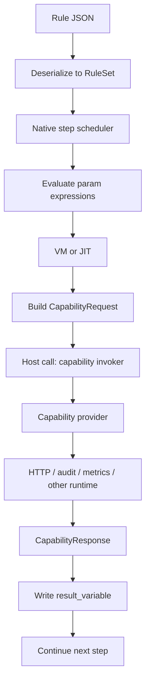

# Execution Model: VM, JIT, and Host Calls

JSON rules are not executable by themselves — they are input data. What actually runs is native code compiled into the server binary, plus bytecode VM or JIT code for expression evaluation.

Ordo's execution chain has four layers:

1. **Rule data** — JSON generated by the platform
2. **Step scheduler** — native code that walks the step graph
3. **Expression layer** — interpreter, bytecode VM, or JIT
4. **Capability layer** — providers for HTTP, metrics, audit, and other side effects

Capabilities are not a replacement for the VM. They are host-call boundaries in the execution chain.

## From JSON to the CPU

At runtime:

1. The server reads rule JSON
2. It deserializes it into `RuleSet`, `Step`, and `ActionKind`
3. A native executor schedules and runs steps
4. Expressions inside those steps are evaluated by the expression layer
5. Outbound behavior crosses into capability providers

Step scheduling is native Rust. VM and JIT handle expression evaluation. Capabilities handle interaction with the outside world.

## What the step scheduler does

The step scheduler decides:

- which step is active
- which branch a decision step should take
- which actions an action step should execute
- when execution reaches a terminal step

This is a native state machine loop — not the VM.

## What the expression VM does

The bytecode VM handles expression evaluation:

- branch conditions
- the right-hand side of `set_variable`
- metric values
- terminal outputs
- parameter expressions inside `ExternalCall`

`BytecodeVM` is a classic dispatch loop: load an instruction, branch on the opcode, read or write register slots. The CPU is executing native Rust machine code that happens to interpret expression bytecode.

Relevant source:

- [`crates/ordo-core/src/expr/compiler.rs`](https://github.com/Ordo-Engine/Ordo/blob/main/crates/ordo-core/src/expr/compiler.rs)
- [`crates/ordo-core/src/expr/vm.rs`](https://github.com/Ordo-Engine/Ordo/blob/main/crates/ordo-core/src/expr/vm.rs)

## What the JIT does

Both the VM and JIT execute native machine code. The difference is that the VM dispatches instruction by instruction, while the JIT emits machine code for hot expressions up front and lets the CPU run that code directly.

The JIT accelerates pure compute paths:

- numeric comparisons
- boolean logic
- field access
- expression composition

It does not perform network IO, audit logging, or metrics emission.

## What a host call is

An outbound capability is not just another opcode — it is a host function call.

The flow:

1. The executor computes request parameters locally
2. It calls `capability_invoker.invoke(...)`
3. The provider performs the real runtime behavior
4. The result is returned into rule context

This is the same boundary you see in WASM host imports, Lua calling C functions, JVM calling JNI, or a database execution plan invoking an external function.

## How `ExternalCall` participates in execution

In the current execution model, `ExternalCall` works like this:

1. Read `service`, `method`, and `params` from the action
2. Evaluate each parameter expression
3. Build a `CapabilityRequest`
4. Invoke the capability boundary
5. If `result_variable` is set, write the response back into context

Implementation:

- [`crates/ordo-core/src/rule/executor.rs`](https://github.com/Ordo-Engine/Ordo/blob/main/crates/ordo-core/src/rule/executor.rs)
- [`crates/ordo-core/src/rule/compiled_executor.rs`](https://github.com/Ordo-Engine/Ordo/blob/main/crates/ordo-core/src/rule/compiled_executor.rs)

## Example: `network.http`

When a rule calls `network.http`:

1. The executor evaluates `url`, `json_body`, and other parameters into `Value`
2. It sends a capability request
3. The `network.http` provider makes the actual HTTP request through `reqwest`
4. The provider wraps the response into `CapabilityResponse`
5. Later rule steps read `$result.payload`

Real network IO happens in the host layer. The VM or JIT only computes the URL, body, headers, and any expressions over the returned result. Sockets, timeouts, Tokio scheduling, and syscalls belong to the host runtime.

## What's supported today

`ExternalCall` now works in both the interpreter path and the compiled executor. Built-in capabilities include `network.http`, `metrics.prometheus`, and `audit.logger`.

That means a rule can stay on the compiled execution path, keep using the VM or JIT for parameter evaluation, and only cross into the host runtime at the action boundary.

## Where this should go

The foundation is now in place. The next step is not "make the VM do HTTP", but to deepen the host-call model across the rest of the platform:

1. Move more side effects behind capability boundaries
2. Expand compiled executor coverage for host-call actions
3. Strengthen timeout, retry, breaker, and observability policies at the capability layer
4. Keep platform-generated rule models aligned with runtime capability support

VM and JIT handle fast computation. Capabilities handle crossing the engine boundary. They are complementary, not competing.
