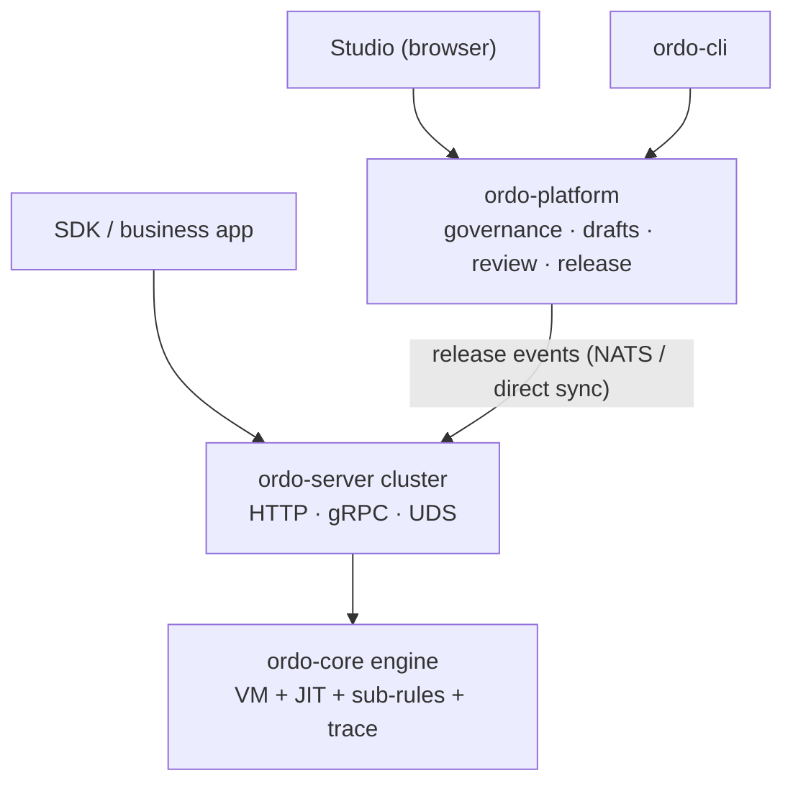

## Architecture



The documentation is organized into two tracks:

- **Platform** — for teams using Ordo Platform / Studio to govern decisions: organization modeling, contracts, release flow, test management.
- **Engine** — for developers integrating ordo-core / ordo-server directly: rule structure, expression syntax, HTTP / gRPC / WASM APIs.

## Quick Example

```json
{
  "config": {
    "name": "discount-check",
    "version": "1.0.0",
    "entry_step": "check_vip"
  },
  "steps": {
    "check_vip": {
      "id": "check_vip",
      "name": "Check VIP Status",
      "type": "decision",
      "branches": [{ "condition": "user.vip == true", "next_step": "vip_discount" }],
      "default_next": "normal_discount"
    },
    "vip_discount": {
      "id": "vip_discount",
      "type": "terminal",
      "result": { "code": "VIP", "message": "20% discount" }
    },
    "normal_discount": {
      "id": "normal_discount",
      "type": "terminal",
      "result": { "code": "NORMAL", "message": "5% discount" }
    }
  }
}
```
