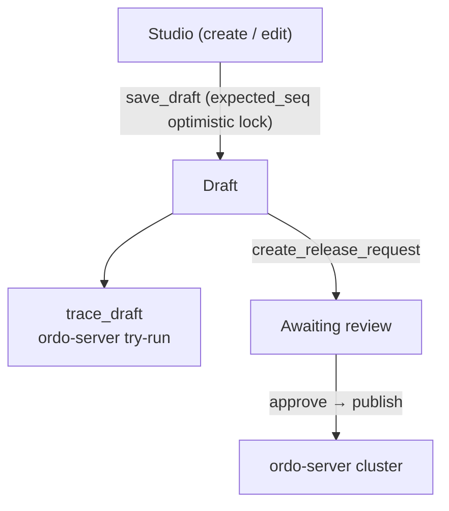

# Rule Drafts

The platform never pushes ruleset edits straight to the execution cluster — they go into a **draft** first. Drafts are the foundation of Studio collaboration and the release pipeline.

## Lifecycle



## Storage Format

Drafts are stored in Studio's natural format (camelCase, `steps` array, structured `Condition` / `Expr`):

```jsonc
{
  "config": { "name": "...", "version": "...", "enableTrace": true },
  "startStepId": "step_a",
  "steps": [
    { "id": "step_a", "type": "decision", "name": "...", "branches": [...] },
    { "id": "step_b", "type": "action",   "name": "...", "assignments": [...], "nextStepId": "step_c" }
  ],
  "subRules": { "kyc": { /* sub-rule graph */ } }
}
```

At publish time, `ordo-protocol` (a Rust crate) converts to engine format before delivery. The frontend no longer maintains adapter conversion logic.

## Optimistic Concurrency

Drafts carry a `seq` number. Concurrent edits use `expected_seq` to avoid clobbering:

```http
POST /api/v1/orgs/:oid/projects/:pid/rulesets/:name
{ "ruleset": { ... }, "expected_seq": 42 }
```

The server returns the latest `seq` and `updated_at`. A mismatch yields `409 Conflict` so the UI can prompt for merge.

## Draft Try-Run (Trace)

```http
POST /api/v1/orgs/:oid/projects/:pid/rulesets/:name/trace
{ "ruleset": { /* draft format */ }, "input": { "user": { "age": 28 } } }
```

The platform handles Studio → engine conversion internally and returns a full trace.

## History

Each release snapshots a read-only history entry:

```http
GET /api/v1/projects/:pid/rulesets/:name/history
```

You can preview any version's diff in Studio and roll back with one click (which actually creates a new release for full audit, never a silent overwrite).

## Related API

| Operation      | Endpoint                                                          |
| -------------- | ----------------------------------------------------------------- |
| List rulesets  | `GET  /api/v1/orgs/:oid/projects/:pid/rulesets`                   |
| Get/save draft | `GET/POST /api/v1/orgs/:oid/projects/:pid/rulesets/:name`         |
| Try-run        | `POST /api/v1/orgs/:oid/projects/:pid/rulesets/:name/trace`       |
| Publish        | `POST /api/v1/orgs/:oid/projects/:pid/rulesets/:name/publish`     |
| History        | `GET  /api/v1/projects/:pid/rulesets/:name/history`               |
| Deployments    | `GET  /api/v1/orgs/:oid/projects/:pid/rulesets/:name/deployments` |
