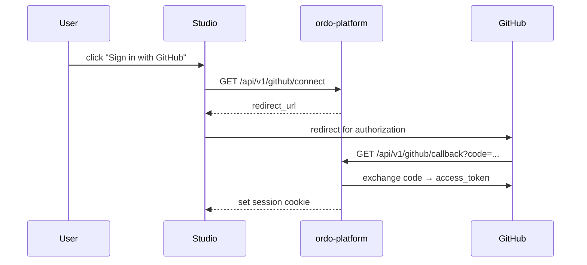

# GitHub Integration

The platform can connect projects to GitHub repositories to:

- Install rule templates from public marketplace repos in one click.
- Sync rulesets / test cases bidirectionally with code repositories (GitOps style).
- Sign in to Studio via GitHub OAuth.

## OAuth Login

## Account Linking

Existing platform accounts can link a GitHub identity:

| Operation  | Endpoint                           |
| ---------- | ---------------------------------- |
| Status     | `GET /api/v1/github/status`        |
| Connect    | `GET /api/v1/github/connect`       |
| Callback   | `GET /api/v1/github/callback`      |
| Disconnect | `DELETE /api/v1/github/disconnect` |

## Marketplace

The platform curates a list of rule-template repos (and supports searching arbitrary public repos).

| Operation | Endpoint                                        |
| --------- | ----------------------------------------------- |
| Search    | `GET  /api/v1/marketplace/search?q=loan`        |
| Get       | `GET  /api/v1/marketplace/repos/:owner/:repo`   |
| Install   | `POST /api/v1/marketplace/install/:owner/:repo` |

Installation clones the repo content (rulesets, contracts, tests) into the current project as a fresh draft awaiting review/release — **never bypassing the approval flow**.

## Templates

Beyond Marketplace, the platform also ships built-in templates:

| Operation | Endpoint                    |
| --------- | --------------------------- |
| List      | `GET /api/v1/templates`     |
| Get       | `GET /api/v1/templates/:id` |

> Pass a `template_id` when creating a project to bootstrap project + template content in one shot (see [Organizations & Projects](./organizations)).
