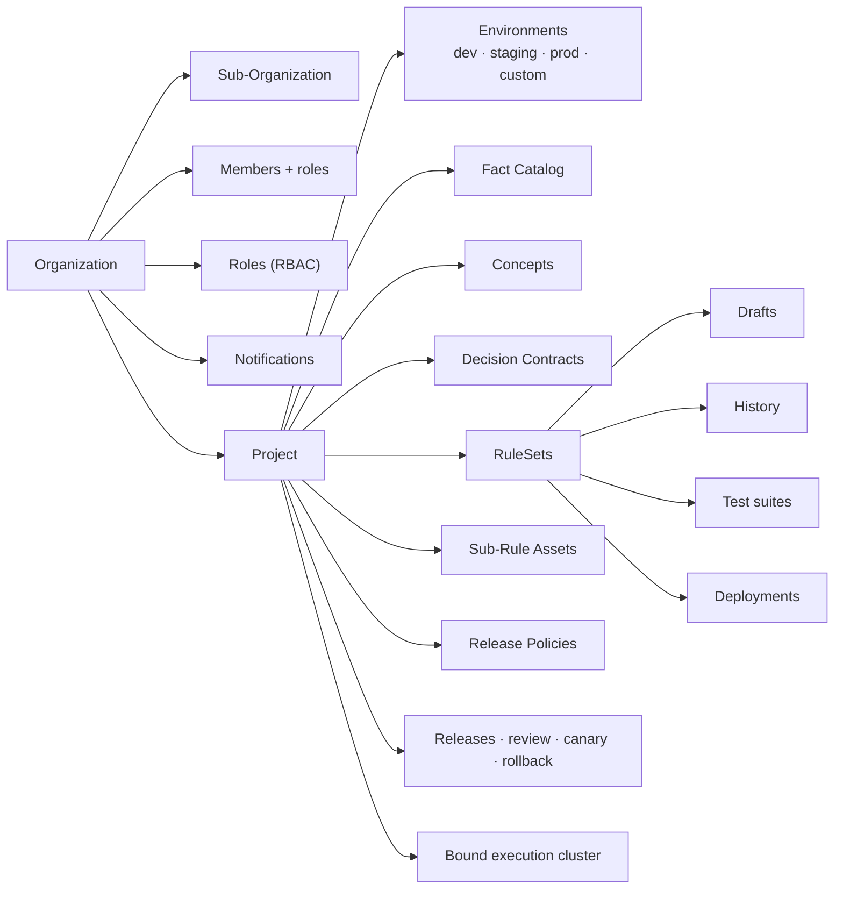

# Platform Overview

Ordo Platform is the governance and collaboration layer of Ordo's decision infrastructure. It wraps the execution engine into a team-facing product: organization modeling, contract definitions, change review, multi-environment release, test management, and audit.

## Platform vs. Engine

The Ordo repository ships two independently-running binaries:

| Component         | Binary          | Role                                                                              |
| ----------------- | --------------- | --------------------------------------------------------------------------------- |
| **ordo-platform** | `ordo-platform` | Control plane: orgs, projects, members, contracts, drafts, releases, tests, audit |
| **ordo-server**   | `ordo-server`   | Data plane: actually executes rules over HTTP / gRPC / UDS                        |
| **ordo-core**     | crate (library) | Engine core: parser, bytecode VM, JIT, trace — embeddable in any Rust app         |

> The platform never executes rules. Rule delivery and execution happen on the `ordo-server` cluster; the platform only governs and coordinates.

## Data Model

## Core Workflow

1. **Model** — define the fact catalog → register concepts → write typed decision contracts.
2. **Author** — write rulesets in Studio against the contract; drop in Sub-Rule assets to reuse logic.
3. **Test** — attach test cases to the ruleset (YAML format, ordo-cli compatible); run on save.
4. **Review** — open a release request → tests + diff run automatically → policy decides reviewers → approval.
5. **Release** — platform syncs rules to the target environment's ordo-servers; canary / pause / rollback are first-class.
6. **Execute** — apps connect directly to ordo-server (or via the platform `/api/v1/engine/:project_id/*path` proxy) for millisecond-level rule eval.
7. **Audit** — every action (draft edit, approval, release, rollback) lands in the audit log.

## Deployment Shapes

- **All-in-one** — single host, platform plus one local ordo-server. Good for small teams or evaluation.
- **Multi-region** — central platform plus regional ordo-server clusters (NA, EU, APAC, …) with [server registry](./server-registry) and execution proxy.
- **Embedded** — skip platform & server, embed `ordo-core` directly in a Rust app for ultra-low-latency inline use.

## Next

- [Organizations & Projects](./organizations) — team modeling and RBAC
- [Fact Catalog](./catalog) — typed inputs and shared concepts
- [Decision Contracts](./contracts) — input/output constraints
- [Studio Editor](./studio) — three modes, real-time sync
- [Release Pipeline](./releases) — draft → review → canary → rollback
- [Test Management](./testing) — cases, suites, CI integration
