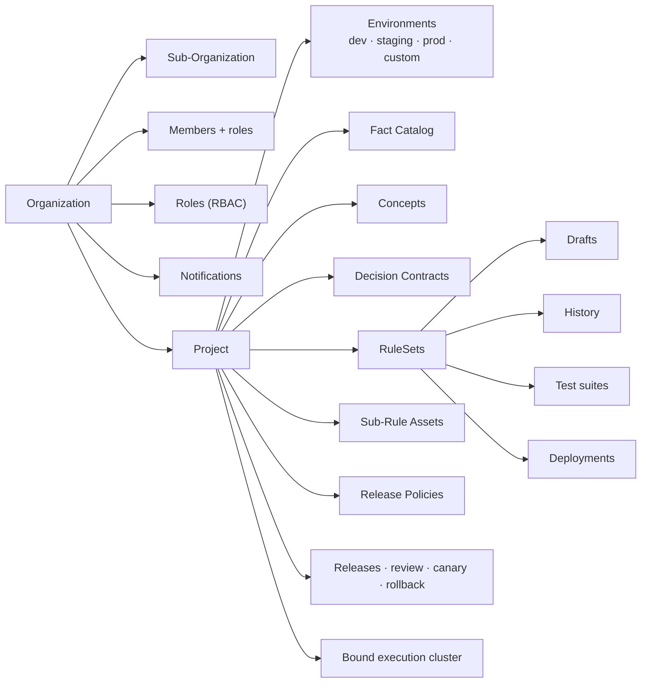

# Platform Overview

Ordo Platform is the team layer on top of the Ordo engine. It adds organizations and projects, decision contracts, change review, multi-environment releases, test management, and audit.

> To build something right away, go to the [Quickstart](./quickstart). This
> page explains the model behind it.

## Platform vs. Engine

The Ordo repository ships two independently-running binaries:

| Component         | Binary          | Role                                                                              |
| ----------------- | --------------- | --------------------------------------------------------------------------------- |
| **ordo-platform** | `ordo-platform` | Control plane: orgs, projects, members, contracts, drafts, releases, tests, audit |
| **ordo-server**   | `ordo-server`   | Data plane: executes rules over HTTP / gRPC / UDS                                 |
| **ordo-core**     | crate (library) | Engine core: parser, bytecode VM, JIT, trace; embeddable in any Rust app          |

> The platform never executes rules. Rule delivery and execution happen on the `ordo-server` cluster; the platform only governs and coordinates.

## Data Model

```mermaid
flowchart LR
  Org["Organization"]
  Org --> SubOrg["Sub-Organization"]
  Org --> Members["Members + roles"]
  Org --> Roles["Roles (RBAC)"]
  Org --> Notif["Notifications"]
  Org --> Project["Project"]

  Project --> Envs["Environments<br/>dev · staging · prod · custom"]
  Project --> Facts["Fact Catalog"]
  Project --> Concepts["Concepts"]
  Project --> Contracts["Decision Contracts"]
  Project --> RuleSets["RuleSets"]
  Project --> SubRules["Sub-Rule Assets"]
  Project --> Policies["Release Policies"]
  Project --> Releases["Releases · review · canary · rollback"]
  Project --> Server["Bound execution cluster"]

  RuleSets --> Drafts["Drafts"]
  RuleSets --> History["History"]
  RuleSets --> Tests["Test suites"]
  RuleSets --> Deployments["Deployments"]
```

## Core Workflow

1. Model: define the fact catalog, register concepts, and write typed decision contracts.
2. Author: write rulesets in Studio against the contract. Use Sub-Rule assets to reuse logic.
3. Test: attach test cases to the ruleset (YAML format, ordo-cli compatible). They run on save.
4. Review: open a release request. Tests and a diff run automatically, the release policy picks reviewers, and they approve.
5. Release: the platform syncs rules to the target environment's ordo-servers. Canary, pause and rollback are built into the release flow.
6. Execute: apps call ordo-server directly (or through the platform's `/api/v1/engine/:project_id/*path` proxy) for millisecond-level rule evaluation.
7. Audit: every action (draft edit, approval, release, rollback) is recorded in the audit log.

## Deployment Shapes

- All-in-one: a single host running the platform and one local ordo-server. Good for small teams or evaluation.
- Multi-region: a central platform plus regional ordo-server clusters (NA, EU, APAC, …), using the [server registry](./server-registry) and execution proxy.
- Embedded: no platform or server. Embed `ordo-core` directly in a Rust app for the lowest latency.

## Next

- [Quickstart](./quickstart): publish your first decision in five minutes
- [Organizations & Projects](./organizations): team modeling and RBAC
- [Fact Catalog](./catalog): typed inputs and shared concepts
- [Decision Contracts](./contracts): input/output constraints
- [Studio Editor](./studio): three modes, real-time sync
- [Release Pipeline](./releases): draft → review → canary → rollback
- [Test Management](./testing): cases, suites, CI integration
