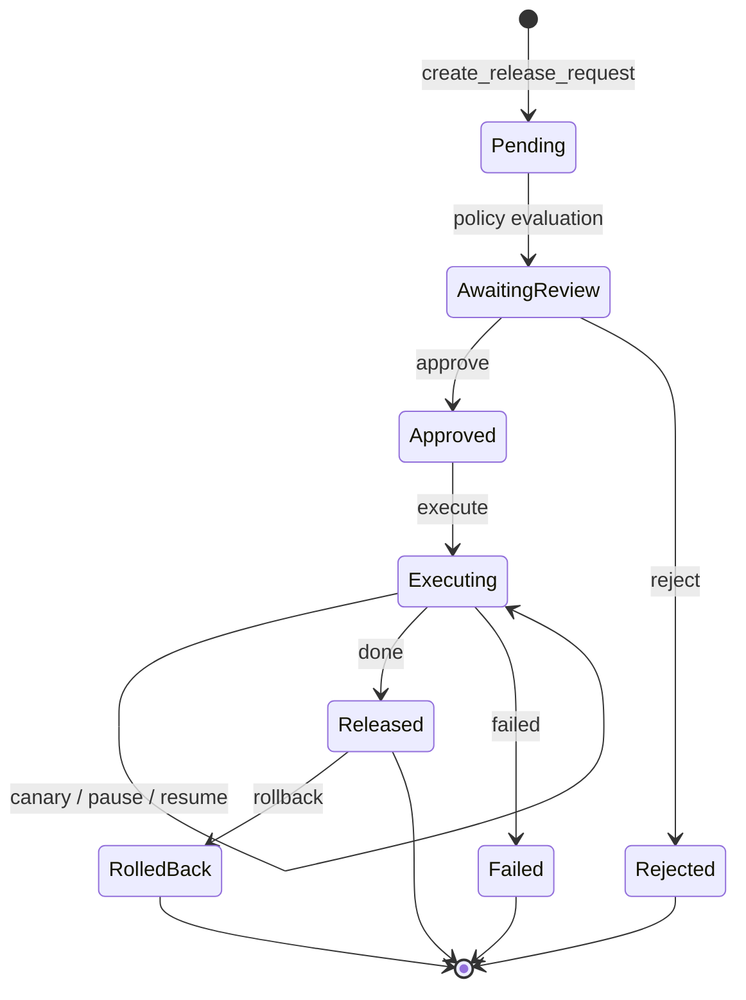

# Release Pipeline

The release pipeline ties drafts, approvals, environments, and rollback together. Every action that pushes rules to a production ordo-server goes through it.

## Flow Overview



## Release Request

```http
POST /api/v1/orgs/:oid/projects/:pid/releases
{
  "rulesets": [
    { "name": "discount-check", "from_seq": 17 }
  ],
  "environments": ["staging", "prod"],
  "title": "v1.4 — add VIP tiering",
  "description": "..."
}
```

The platform will:

1. Run any test suites attached to the ruleset — failures block creation.
2. Generate a [diff](https://github.com/Ordo-Engine/Ordo) against the current active version in each target environment (step add/remove, branch deltas, contract diff).
3. Evaluate [release policies](#release-policy) to determine required reviewers.

## Release Policy

A project can define multiple policies, matched by priority:

```jsonc
{
  "name": "prod-strict",
  "match": { "environments": ["prod"] },
  "approvers": {
    "min_count": 2,
    "roles": ["admin"],
    "exclude_authors": true
  },
  "auto_run_tests": true,
  "freeze_window": { "cron": "0 0 * * 5-6", "duration": "48h" }
}
```

API: `/api/v1/orgs/:oid/projects/:pid/release-policies`.

## Approvals

- `POST .../releases/:rid/approve` — approve
- `POST .../releases/:rid/reject` — reject (with reason)
- `GET  /api/v1/orgs/:oid/releases/pending-for-me` — list pending for me

## Execution & Canary

```http
POST .../releases/:rid/execute
```

On execute, the platform syncs rules to the target ordo-server cluster. Canary is first-class:

| Operation        | Endpoint                                              |
| ---------------- | ----------------------------------------------------- |
| Pause            | `POST .../releases/:rid/pause`                        |
| Resume           | `POST .../releases/:rid/resume`                       |
| Rollback         | `POST .../releases/:rid/rollback`                     |
| Current snapshot | `GET  .../releases/:rid/execution`                    |
| History          | `GET  .../releases/:rid/history`                      |
| Event stream     | `GET  .../releases/:rid/executions/:eid/events` (SSE) |

Per-environment canary config: `PUT /api/v1/orgs/:oid/projects/:pid/environments/:eid/canary`.

## Rollback

Any released release can be rolled back in one click: the platform finds the last stable version from history and **creates a new** rollback release that is auto-approved (preserving the audit trail) — never a silent overwrite.

## Preview

```http
POST .../releases/preview
```

See diffs and policy evaluation without creating a release — handy for a final pre-release check.
