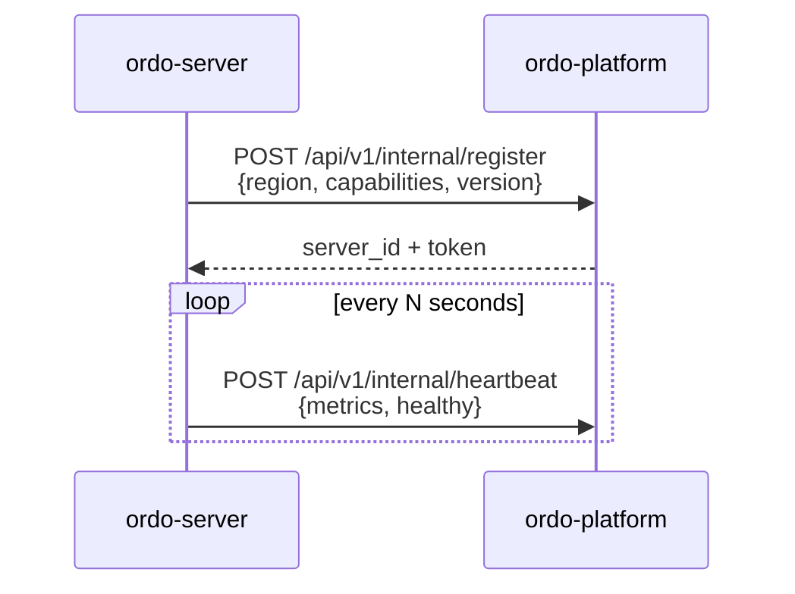
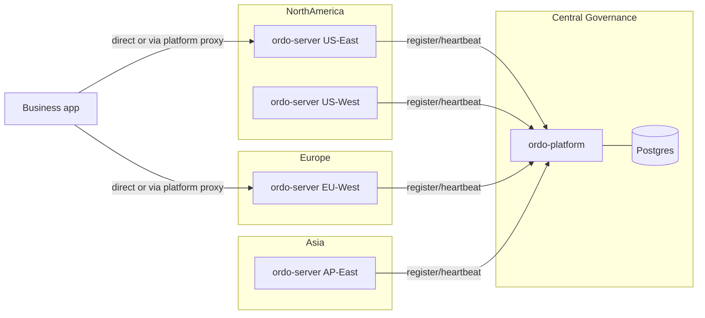

# Server Registry & Multi-Region

Platform and execution nodes are loosely coupled — `ordo-server` instances **register themselves** with the platform on startup, and the platform maintains a directory used for release delivery and proxy routing.

## Registration Flow



> `/api/v1/internal/*` are machine-to-machine endpoints authenticated by server tokens — never exposed to browsers or SDKs.

## Org Connect Tokens

An engine is scoped to an **organization** by the token it registers with. Mint a
**connect token** for an org, hand it to that org's engines, and they register
into that org — never into a global pool visible to everyone.

```http
POST   /api/v1/orgs/:oid/connect-tokens      # mint (returns the raw token ONCE)
GET    /api/v1/orgs/:oid/connect-tokens      # list metadata (never the raw token)
DELETE /api/v1/orgs/:oid/connect-tokens/:id  # revoke
```

Point an engine at it via flag or env:

```bash
ordo-server --platform-connect-token ordo_connect_xxxx, or
ORDO_CONNECT_TOKEN=ordo_connect_xxxx ordo-server
```

The engine sends the token as an `x-connect-token` header on registration; the
platform derives the owning org from it and records the server under that org.
The token both **authorizes** registration and **scopes** the engine — it
replaces the global `--platform-registration-secret` for org-scoped setups.

Consequences:

- The [server directory](#server-directory) and the [project binding](#project-binding)
  picker only show engines registered to an org you belong to.
- A project may bind **only** to an engine in its own organization; binding to a
  server from another org is rejected.
- Revoking a token stops new registrations with it; already-registered servers
  keep their assigned org (delete the server to remove it).

> **Upgrading an existing engine.** An engine registered before connect tokens
> (or without one) has no org and is no longer listed under any org. Mint a token,
> set `ORDO_CONNECT_TOKEN`, and restart the engine — it re-registers into the org.

## Server Directory

| Operation  | Endpoint                          |
| ---------- | --------------------------------- |
| List       | `GET /api/v1/servers`             |
| Get        | `GET /api/v1/servers/:id`         |
| Health     | `GET /api/v1/servers/:id/health`  |
| Metrics    | `GET /api/v1/servers/:id/metrics` |
| Deregister | `DELETE /api/v1/servers/:id`      |

Server record fields:

- `region` — deployment region tag
- `capabilities` — enabled features (e.g. `jit`, `signature`)
- `healthy` / `last_heartbeat`
- `current_rulesets` — ruleset digests held now

## Project Binding

Each project binds one or more servers (optionally per-environment). The binding controls:

1. Which ordo-servers receive a release.
2. Where business requests are routed when going through the platform proxy.

```http
PUT /api/v1/orgs/:oid/projects/:pid/server
{ "environment": "prod", "server_ids": ["s_eu", "s_us"] }
```

## Execution Proxy

Apps may not be able to reach regional ordo-servers directly. The platform offers a transparent proxy:

```http
POST /api/v1/engine/:project_id/execute
```

Requests are routed to the ordo-server bound for the project's current environment, preserving original latency metrics (the platform forwards but does not parse).

When to use it:

- Apps can only reach the public platform domain.
- Multi-region failover — health-aware routing falls back to a backup server.
- Canary traffic split — during canary releases, the platform splits traffic by ratio between old and new servers.

## Multi-Region Example


