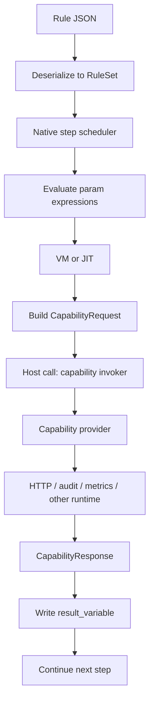

# 执行模型：VM、JIT 与 Host Call

JSON 规则本身不会被 CPU 直接执行，它只是输入数据。真正执行的是 server 里已经编译好的本地代码，以及在表达式层出现的 VM 或 JIT 代码。

整个执行链可以拆成 4 层：

1. **规则数据层** — 平台生成的 JSON 规则
2. **步骤调度层** — 负责遍历 step 图的原生代码
3. **表达式执行层** — 解释器、字节码 VM、或 JIT
4. **宿主能力层** — capability provider，负责 HTTP、metrics、audit 等副作用

`capability` 不是 VM 的替代品，而是执行链中的 host call 边界。

## 从 JSON 到 CPU

运行时真正发生的是：

1. server 读取 JSON
2. 反序列化成 `RuleSet` / `Step` / `ActionKind`
3. 本地执行器按 step 调度执行
4. step 中需要求值的表达式交给表达式层
5. 遇到外部能力时切到 capability provider

step 调度本身是原生 Rust 代码；VM/JIT 主要负责表达式求值；capability 负责和外部世界交互。

## 步骤调度层在做什么

步骤调度层决定：

- 当前在哪个 step
- decision step 该走哪条 branch
- action step 需要执行哪些 action
- 什么时候到 terminal step 返回结果

这一层本质上是一个原生状态机循环，不是 VM。

## 表达式 VM 在做什么

字节码 VM 只负责表达式求值：

- branch condition
- `set_variable` 右边的表达式
- `metric` action 的 value
- terminal output
- `ExternalCall` 参数中的表达式

`BytecodeVM` 是一个典型的 dispatch loop：读取一条指令，按 opcode 分支，再读写寄存器槽。CPU 真正执行的仍然是 Rust 编译出来的机器码，只是这些机器码解释的是另一层表达式字节码。

对应源码：

- [`crates/ordo-core/src/expr/compiler.rs`](https://github.com/Ordo-Engine/Ordo/blob/main/crates/ordo-core/src/expr/compiler.rs)
- [`crates/ordo-core/src/expr/vm.rs`](https://github.com/Ordo-Engine/Ordo/blob/main/crates/ordo-core/src/expr/vm.rs)

## JIT 在做什么

JIT 和 VM 都在执行本地机器码，区别在于有没有 dispatch loop。VM 每一步都要取指、分发、执行；JIT 则把热表达式提前编译成一段机器码，CPU 直接运行。

JIT 优化的是纯计算路径：

- 数值比较
- 布尔判断
- 字段访问
- 表达式组合

JIT 不负责做网络、日志、指标这些副作用。

## Host Call 是什么

外部能力的本质不是"规则语言的一条普通指令"，而是一次宿主函数调用：

1. 执行器在本地把参数算好
2. 调用 `capability_invoker.invoke(...)`
3. provider 在宿主运行时里完成真实行为
4. 再把结果返回给规则上下文

这和 WASM 调 host import、Lua 调 C function、JVM 调 JNI、数据库执行计划调外部函数是同一种边界。

## `ExternalCall` 在执行链里怎么参与

当前执行链里，`ExternalCall` 会：

1. 从 action 里读取 `service`、`method`、`params`
2. 逐个求值参数表达式
3. 组装 `CapabilityRequest`
4. 调用 capability invoker
5. 如果配置了 `result_variable`，把响应写回上下文

对应实现见：

- [`crates/ordo-core/src/rule/executor.rs`](https://github.com/Ordo-Engine/Ordo/blob/main/crates/ordo-core/src/rule/executor.rs)
- [`crates/ordo-core/src/rule/compiled_executor.rs`](https://github.com/Ordo-Engine/Ordo/blob/main/crates/ordo-core/src/rule/compiled_executor.rs)

## 以 `network.http` 为例

如果规则里调用的是 `network.http`：

1. 执行器先把 `url`、`json_body` 等参数表达式算成 `Value`
2. 然后发出 capability 请求
3. `network.http` provider 用 `reqwest` 发起真实 HTTP 请求
4. provider 把响应包装成 `CapabilityResponse`
5. 规则后续步骤再继续读取 `$result.payload`

真正的网络 IO 发生在 host 层，而不是 VM 里。VM/JIT 只负责计算 URL、body、headers，以及对返回值求值。HTTP socket、超时、Tokio runtime、syscall 都属于宿主运行时。

## 目前支持什么

解释执行和 compiled executor 现在都支持 `ExternalCall`，内置 capability 包括 `network.http`、`metrics.prometheus`、`audit.logger`。

这意味着规则图仍然可以走编译执行链，参数表达式继续用 VM/JIT 计算，外部调用只在 action 节点跨到 host capability。

## 长期应该走向哪里

当前已经具备 host-call action 的基础形态，后续重点不再是“能不能调 capability”，而是继续把这条链路和平台能力做深：

1. 让更多外部副作用统一走 capability 边界
2. 继续扩展 compiled executor 对宿主调用的覆盖面
3. 在 capability 层补齐更强的超时、重试、熔断与观测
4. 让平台生成模型和运行时能力保持一一对应

VM/JIT 负责算得快，capability 负责跨出引擎边界，两者是衔接关系。
