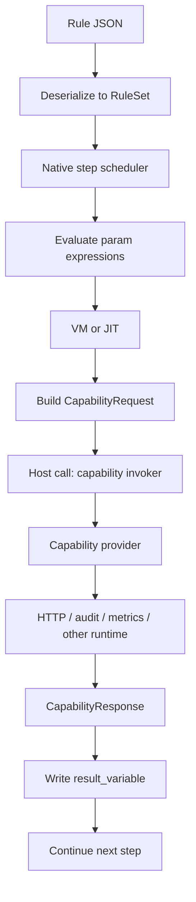

# 执行模型：VM、JIT 与 Host Call

JSON 规则本身不会被 CPU 直接执行，它只是输入数据。执行的是 server 里编译好的本地代码，以及表达式层的 VM 或 JIT 代码。

执行链分为 4 层：

1. 规则数据层：平台生成的 JSON 规则
2. 步骤调度层：遍历 step 图的原生代码
3. 表达式执行层：解释器、字节码 VM 或 JIT
4. 宿主能力层：capability provider，负责 HTTP、metrics、audit 等副作用

`capability` 是执行链中的 host call 边界，不替代 VM。

## 从 JSON 到 CPU

运行时的过程：

1. server 读取 JSON
2. 反序列化成 `RuleSet` / `Step` / `ActionKind`
3. 本地执行器按 step 调度执行
4. step 中需要求值的表达式交给表达式层
5. 遇到外部能力时切到 capability provider

step 调度是原生 Rust 代码；VM/JIT 主要负责表达式求值；capability 负责和外部系统交互。

## 步骤调度层在做什么

步骤调度层决定：

- 当前在哪个 step
- decision step 该走哪条 branch
- action step 需要执行哪些 action
- 什么时候到 terminal step 返回结果

这一层是一个原生的状态机循环，不是 VM。

## 表达式 VM 在做什么

字节码 VM 只负责表达式求值：

- branch condition
- `set_variable` 右边的表达式
- `metric` action 的 value
- terminal output
- `ExternalCall` 参数中的表达式

`BytecodeVM` 是一个典型的 dispatch loop：读取一条指令，按 opcode 分支，再读写寄存器槽。CPU 执行的仍然是 Rust 编译出的机器码，这些机器码负责解释表达式字节码。

对应源码：

- [`crates/ordo-core/src/expr/compiler.rs`](https://github.com/Ordo-Engine/Ordo/blob/main/crates/ordo-core/src/expr/compiler.rs)
- [`crates/ordo-core/src/expr/vm.rs`](https://github.com/Ordo-Engine/Ordo/blob/main/crates/ordo-core/src/expr/vm.rs)

## JIT 在做什么

JIT 和 VM 执行的都是本地机器码，区别在于有没有 dispatch loop。VM 每一步都要取指、分发、执行；JIT 把热表达式提前编译成一段机器码，由 CPU 直接运行。

JIT 优化的是纯计算路径：

- 数值比较
- 布尔判断
- 字段访问
- 表达式组合

网络、日志、指标这些副作用不由 JIT 处理。

## Host Call 是什么

调用外部能力是一次宿主函数调用，不是规则语言里的普通指令：

1. 执行器在本地把参数算好
2. 调用 `capability_invoker.invoke(...)`
3. provider 在宿主运行时里执行实际操作
4. 把结果返回给规则上下文

这和 WASM 调用 host import、Lua 调用 C function、JVM 调用 JNI、数据库执行计划调用外部函数属于同一类边界。

## `ExternalCall` 在执行链里怎么参与

在当前执行链里，`ExternalCall` 会：

1. 从 action 里读取 `service`、`method`、`params`
2. 逐个求值参数表达式
3. 组装 `CapabilityRequest`
4. 调用 capability invoker
5. 如果配置了 `result_variable`，把响应写回上下文

对应实现见：

- [`crates/ordo-core/src/rule/executor.rs`](https://github.com/Ordo-Engine/Ordo/blob/main/crates/ordo-core/src/rule/executor.rs)
- [`crates/ordo-core/src/rule/compiled_executor.rs`](https://github.com/Ordo-Engine/Ordo/blob/main/crates/ordo-core/src/rule/compiled_executor.rs)

```mermaid
flowchart TD
    A[Rule JSON] --> B[Deserialize to RuleSet]
    B --> C[Native step scheduler]
    C --> D[Evaluate param expressions]
    D --> E[VM or JIT]
    E --> F[Build CapabilityRequest]
    F --> G[Host call: capability invoker]
    G --> H[Capability provider]
    H --> I[HTTP / audit / metrics / other runtime]
    I --> J[CapabilityResponse]
    J --> K[Write result_variable]
    K --> L[Continue next step]
```

## 以 `network.http` 为例

规则调用 `network.http` 时：

1. 执行器先把 `url`、`json_body` 等参数表达式求值为 `Value`
2. 然后发出 capability 请求
3. `network.http` provider 用 `reqwest` 发起 HTTP 请求
4. provider 把响应包装成 `CapabilityResponse`
5. 规则的后续步骤读取 `$result.payload`

网络 IO 发生在 host 层，不在 VM 里。VM/JIT 只负责计算 URL、body、headers，以及对返回值求值。HTTP socket、超时、Tokio runtime、syscall 都属于宿主运行时。

## 目前支持什么

解释执行和 compiled executor 现在都支持 `ExternalCall`，内置 capability 包括 `network.http`、`metrics.prometheus`、`audit.logger`。

因此规则图仍然可以走编译执行链，参数表达式继续用 VM/JIT 计算，只有 action 节点上的外部调用会进入 host capability。

## 后续方向

host-call action 的基础形态已经具备。后续的重点是继续完善这条链路和平台能力：

1. 让更多外部副作用统一走 capability 边界
2. 继续扩展 compiled executor 对宿主调用的覆盖面
3. 在 capability 层补齐超时、重试、熔断与观测
4. 让平台生成模型和运行时能力保持一一对应

VM/JIT 负责快速计算，capability 负责与引擎外部交互。
