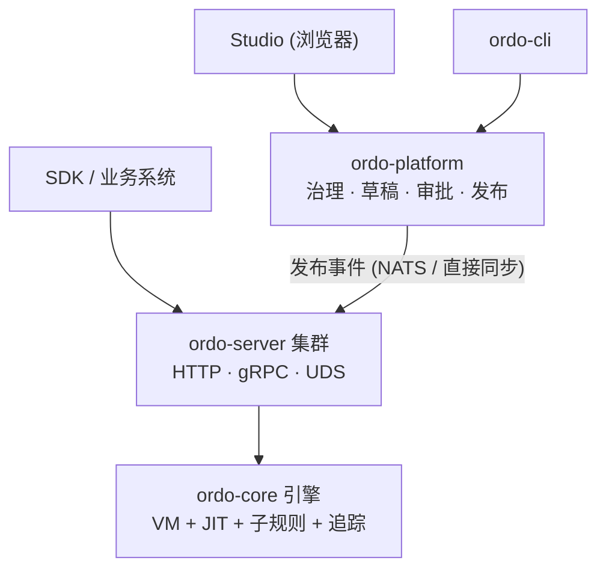

## 架构概览



Ordo 的文档分为两大部分：

- **平台篇**——面向使用 Ordo Platform / Studio 治理决策的团队：组织建模、契约、发布流程、测试管理。
- **引擎篇**——面向需要直接集成 ordo-core / ordo-server 的开发者：规则结构、表达式语法、HTTP / gRPC / WASM API。

## 快速示例

```json
{
  "config": {
    "name": "discount-check",
    "version": "1.0.0",
    "entry_step": "check_vip"
  },
  "steps": {
    "check_vip": {
      "id": "check_vip",
      "name": "Check VIP Status",
      "type": "decision",
      "branches": [{ "condition": "user.vip == true", "next_step": "vip_discount" }],
      "default_next": "normal_discount"
    },
    "vip_discount": {
      "id": "vip_discount",
      "type": "terminal",
      "result": { "code": "VIP", "message": "20% discount" }
    },
    "normal_discount": {
      "id": "normal_discount",
      "type": "terminal",
      "result": { "code": "NORMAL", "message": "5% discount" }
    }
  }
}
```
