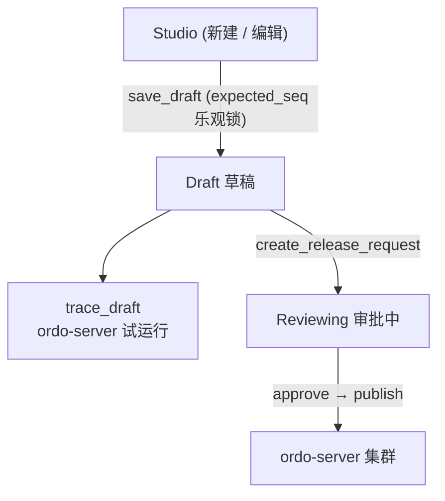

# 规则草稿

平台对规则集的修改不会立即下发到执行集群，而是先写入一份**草稿**（draft）。草稿是 Studio 协同与发布流程的基础。

## 生命周期



## 数据形态

草稿在 DB 中以 Studio 自然格式（camelCase、`steps` 数组、结构化 `Condition` / `Expr`）保存：

```jsonc
{
  "config": { "name": "...", "version": "...", "enableTrace": true },
  "startStepId": "step_a",
  "steps": [
    { "id": "step_a", "type": "decision", "name": "...", "branches": [...] },
    { "id": "step_b", "type": "action",   "name": "...", "assignments": [...], "nextStepId": "step_c" }
  ],
  "subRules": { "kyc": { /* sub-rule graph */ } }
}
```

发布时由 `ordo-protocol`（Rust crate）转换为引擎格式后再下发。前端不再需要维护 adapter 转换逻辑。

## 乐观并发控制

草稿带 `seq` 序列号，多人协作时通过 `expected_seq` 提交避免覆盖：

```http
POST /api/v1/orgs/:oid/projects/:pid/rulesets/:name
{ "ruleset": { ... }, "expected_seq": 42 }
```

服务器返回最新 `seq` 与 `updated_at`。版本不匹配会返回 `409 Conflict`，前端提示用户合并。

## 草稿试运行（Trace）

```http
POST /api/v1/orgs/:oid/projects/:pid/rulesets/:name/trace
{ "ruleset": { /* 草稿格式 */ }, "input": { "user": { "age": 28 } } }
```

平台内部完成 Studio → 引擎格式转换，调用 ordo-server，返回完整 trace。

## 历史版本

每次发布都会快照一份只读历史：

```http
GET /api/v1/projects/:pid/rulesets/:name/history
```

可在 Studio 中预览任意历史版本的 diff，并一键回滚（实际通过新建发布请求实现，保留审计链）。

## 相关 API

| 操作      | 端点                                                              |
| --------- | ----------------------------------------------------------------- |
| 列规则集  | `GET  /api/v1/orgs/:oid/projects/:pid/rulesets`                   |
| 取/存草稿 | `GET/POST /api/v1/orgs/:oid/projects/:pid/rulesets/:name`         |
| 试运行    | `POST /api/v1/orgs/:oid/projects/:pid/rulesets/:name/trace`       |
| 发布      | `POST /api/v1/orgs/:oid/projects/:pid/rulesets/:name/publish`     |
| 历史版本  | `GET  /api/v1/projects/:pid/rulesets/:name/history`               |
| 部署记录  | `GET  /api/v1/orgs/:oid/projects/:pid/rulesets/:name/deployments` |
