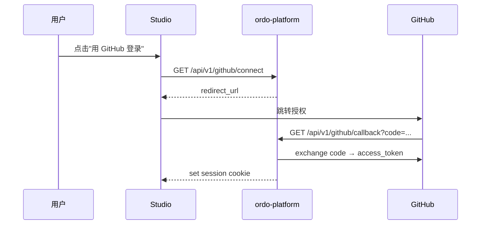

# GitHub 集成

平台支持把项目与 GitHub 仓库连接，用于：

- 从公开 marketplace 仓库一键安装规则模板。
- 把规则集 / 测试用例双向同步到代码仓库（GitOps 风格）。
- 用 GitHub OAuth 登录 Studio。

## OAuth 登录

## 账户连接

已有平台账户可绑定 GitHub：

| 操作 | 端点                               |
| ---- | ---------------------------------- |
| 状态 | `GET /api/v1/github/status`        |
| 连接 | `GET /api/v1/github/connect`       |
| 回调 | `GET /api/v1/github/callback`      |
| 解绑 | `DELETE /api/v1/github/disconnect` |

## Marketplace

平台维护一份精选的规则模板仓库列表（也支持搜索任意公开仓库）。

| 操作 | 端点                                            |
| ---- | ----------------------------------------------- |
| 搜索 | `GET  /api/v1/marketplace/search?q=loan`        |
| 详情 | `GET  /api/v1/marketplace/repos/:owner/:repo`   |
| 安装 | `POST /api/v1/marketplace/install/:owner/:repo` |

安装流程会克隆仓库内容（规则集、契约、测试用例）到当前项目，作为新草稿等待审批发布——**不会绕过审批流程**。

## 模板入口

除了从 Marketplace 安装，平台也内置了一份本地模板：

| 操作 | 端点                        |
| ---- | --------------------------- |
| 列出 | `GET /api/v1/templates`     |
| 详情 | `GET /api/v1/templates/:id` |

> 创建项目时直接传 `template_id`，可一键完成项目 + 模板内容的初始化（参见 [组织与项目](./organizations)）。
