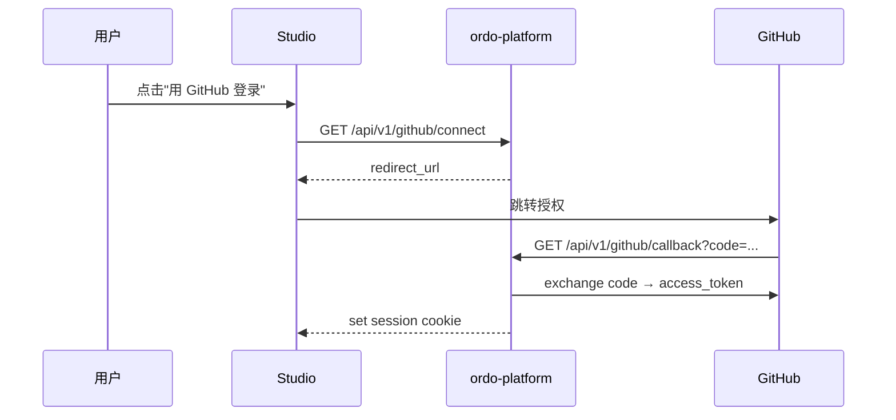

# GitHub 集成

平台支持把项目与 GitHub 仓库连接，用于：

- 从公开的 marketplace 仓库安装规则模板。
- 把规则集 / 测试用例双向同步到代码仓库（GitOps 风格）。
- 用 GitHub OAuth 登录 Studio。

## OAuth 登录

```mermaid
sequenceDiagram
  participant U as 用户
  participant Studio
  participant Platform as ordo-platform
  participant GH as GitHub

  U->>Studio: 点击"用 GitHub 登录"
  Studio->>Platform: GET /api/v1/github/connect
  Platform-->>Studio: redirect_url
  Studio->>GH: 跳转授权
  GH->>Platform: GET /api/v1/github/callback?code=...
  Platform->>GH: exchange code → access_token
  Platform-->>Studio: set session cookie
```

## 账户连接

已有的平台账户可以绑定 GitHub：

| 操作 | 端点                               |
| ---- | ---------------------------------- |
| 状态 | `GET /api/v1/github/status`        |
| 连接 | `GET /api/v1/github/connect`       |
| 回调 | `GET /api/v1/github/callback`      |
| 解绑 | `DELETE /api/v1/github/disconnect` |

## Marketplace

平台维护一份规则模板仓库列表，也支持搜索任意公开仓库。

| 操作 | 端点                                            |
| ---- | ----------------------------------------------- |
| 搜索 | `GET  /api/v1/marketplace/search?q=loan`        |
| 详情 | `GET  /api/v1/marketplace/repos/:owner/:repo`   |
| 安装 | `POST /api/v1/marketplace/install/:owner/:repo` |

安装会把仓库内容（规则集、契约、测试用例）克隆到当前项目，作为新草稿等待审批发布，不会绕过审批流程。

## 模板入口

除了从 Marketplace 安装，平台还内置了一组本地模板：

| 操作 | 端点                        |
| ---- | --------------------------- |
| 列出 | `GET /api/v1/templates`     |
| 详情 | `GET /api/v1/templates/:id` |

> 创建项目时传入 `template_id`，会同时用模板内容初始化项目（参见[组织与项目](./organizations)）。
