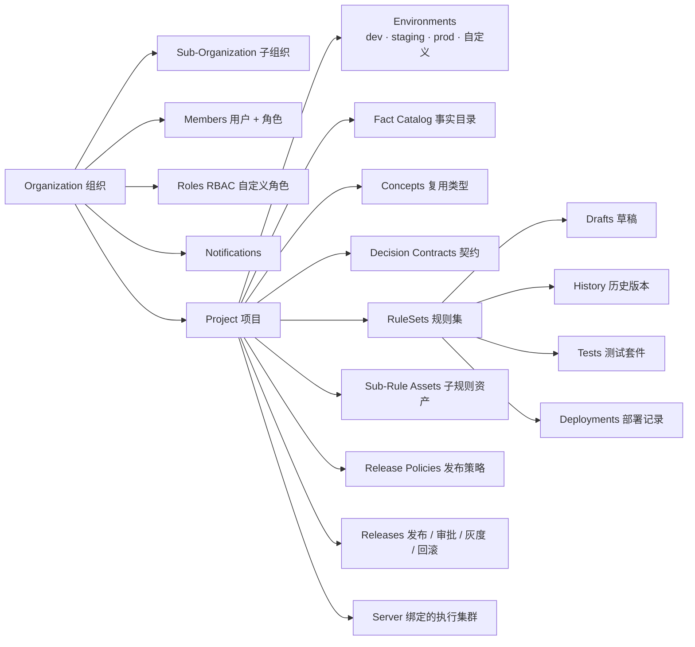

# 平台概览

Ordo Platform 是 Ordo 决策基础设施的治理与协作层。它把执行引擎包装成一个面向团队的产品：组织建模、契约定义、变更审批、多环境发布、测试管理与审计。

## 平台 vs 引擎

Ordo 仓库内同时维护两套独立运行的二进制：

| 组件              | 二进制          | 作用                                                           |
| ----------------- | --------------- | -------------------------------------------------------------- |
| **ordo-platform** | `ordo-platform` | 治理面：组织/项目/成员、契约、草稿、审批、发布、测试套件、审计 |
| **ordo-server**   | `ordo-server`   | 数据面：实际执行规则（HTTP / gRPC / UDS）                      |
| **ordo-core**     | crate（库）     | 引擎核心：解析、字节码、JIT、追踪——可嵌入任意 Rust 应用        |

> 平台不会执行规则。规则的下发与执行都在 `ordo-server` 集群完成，平台只负责治理与协调。

## 数据模型

## 核心流程

1. **建模**：在项目中定义事实目录 → 注册概念 → 编写带类型的决策契约。
2. **创作**：在 Studio 编辑器里基于契约编写规则集，可拖入 Sub-Rule 资产复用逻辑。
3. **测试**：为规则集挂载测试用例（YAML 格式，与 ordo-cli 兼容），保存时即可一键运行。
4. **审批**：发起发布请求 → 自动跑测试 + 生成 diff → 触发审批策略 → 审批人通过。
5. **发布**：平台向目标环境对应的 ordo-server 同步规则；支持灰度、暂停、回滚。
6. **执行**：业务系统直连 ordo-server（或经平台 `/api/v1/engine/:project_id/*path` 代理）执行规则，毫秒级响应。
7. **审计**：所有动作（草稿编辑、审批、发布、回滚）写入审计日志。

## 部署形态

- **All-in-one**：单机部署，平台 + 一个本地 ordo-server，适合小团队或评估。
- **多区域**：中央平台 + 多个区域的 ordo-server 集群（北美、欧洲、亚洲等），通过 [服务器注册](./server-registry) 与执行代理统一调度。
- **嵌入式**：跳过平台与服务器，直接在 Rust 应用中使用 `ordo-core`，适合超低延迟内联场景。

## 下一步

- [组织与项目](./organizations) — 团队建模与 RBAC
- [事实目录](./catalog) — 类型化输入与共享概念
- [决策契约](./contracts) — 规则的输入/输出约束
- [Studio 编辑器](./studio) — 三种模式与协同
- [发布流程](./releases) — 草稿 → 审批 → 灰度 → 回滚
- [测试管理](./testing) — 用例、套件、CI 集成
