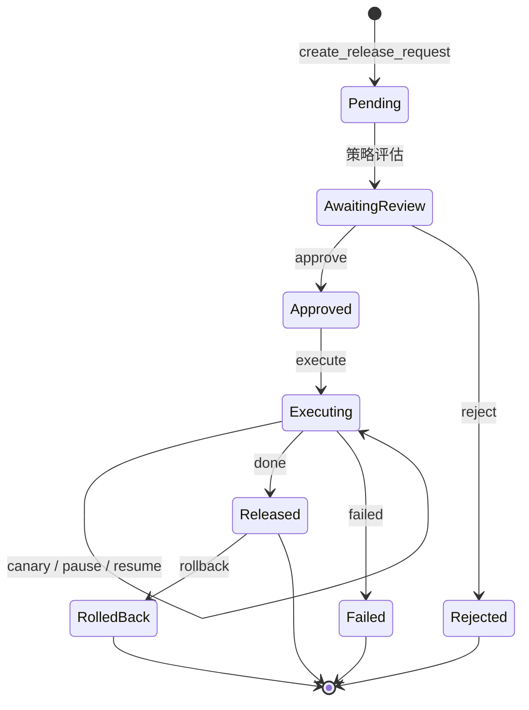

# 发布流程

发布流程连接草稿、审批、环境与回滚。把规则下发到生产 ordo-server 必须经过这个流程。

## 流程总览


```mermaid
stateDiagram-v2
  [*] --> Pending: create_release_request
  Pending --> AwaitingReview: 策略评估
  AwaitingReview --> Approved: approve
  AwaitingReview --> Rejected: reject
  Approved --> Executing: execute
  Executing --> Executing: canary / pause / resume
  Executing --> Released: done
  Executing --> Failed: failed
  Released --> RolledBack: rollback
  Released --> [*]
  Rejected --> [*]
  Failed --> [*]
  RolledBack --> [*]
```

## 发布请求（Release Request）

```http
POST /api/v1/orgs/:oid/projects/:pid/releases
{
  "rulesets": [
    { "name": "discount-check", "from_seq": 17 }
  ],
  "environments": ["staging", "prod"],
  "title": "v1.4 — 增加 VIP 阶梯",
  "description": "..."
}
```

创建发布请求后，平台会：

1. 运行 ruleset 上的测试套件，失败则不允许创建。
2. 生成与目标环境当前活跃版本之间的 [diff](https://github.com/Ordo-Engine/Ordo)（步骤增删、分支变化、契约对比）。
3. 评估[审批策略](#审批策略-release-policy)，确定需要的审批人。

## 审批策略（Release Policy）

每个项目可以定义多条策略，按优先级匹配：

```jsonc
{
  "name": "prod-strict",
  "match": { "environments": ["prod"] },
  "approvers": {
    "min_count": 2,
    "roles": ["admin"],
    "exclude_authors": true
  },
  "auto_run_tests": true,
  "freeze_window": { "cron": "0 0 * * 5-6", "duration": "48h" }
}
```

API：`/api/v1/orgs/:oid/projects/:pid/release-policies`。

## 审批

- `POST .../releases/:rid/approve`：同意
- `POST .../releases/:rid/reject`：拒绝并附原因
- `GET  /api/v1/orgs/:oid/releases/pending-for-me`：列出待我审批的请求

## 执行与灰度

```http
POST .../releases/:rid/execute
```

执行时，平台向目标 ordo-server 集群同步规则，可以选择灰度：

| 操作     | 端点                                                  |
| -------- | ----------------------------------------------------- |
| 暂停     | `POST .../releases/:rid/pause`                        |
| 继续     | `POST .../releases/:rid/resume`                       |
| 回滚     | `POST .../releases/:rid/rollback`                     |
| 当前快照 | `GET  .../releases/:rid/execution`                    |
| 历史     | `GET  .../releases/:rid/history`                      |
| 事件流   | `GET  .../releases/:rid/executions/:eid/events` (SSE) |

环境的灰度配置：`PUT /api/v1/orgs/:oid/projects/:pid/environments/:eid/canary`。

## 回滚

已发布的 release 都可以回滚。平台从历史中找到上一个稳定版本，新建一条 rollback release 并自动通过审批，不直接覆写，审计记录保持完整。

## 预览

```http
POST .../releases/preview
```

不创建 release 也能查看 diff 和策略评估结果，用于发布前确认。
