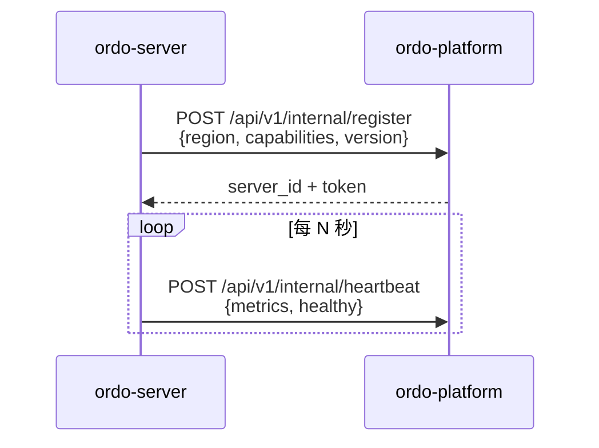
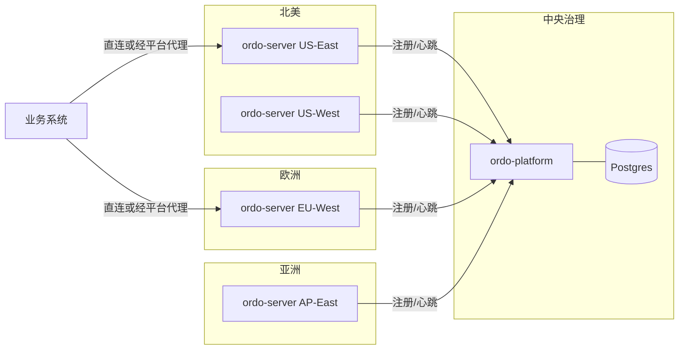

# 服务器注册与多区域

平台和执行节点之间是松耦合的——`ordo-server` 实例运行后**主动**向平台注册自己，平台维护一份服务器目录用于发布与代理。

## 注册流程



> `/api/v1/internal/*` 是机器对机器端点，使用 server token 鉴权，不暴露给浏览器或 SDK。

## 组织接入令牌(Connect Token)

引擎归属哪个**组织**,由它注册时带的令牌决定。给某个组织铸一个**接入令牌**,发给该组织的引擎,它们就注册进这个组织——而不是落进一个人人可见的全局池。

```http
POST   /api/v1/orgs/:oid/connect-tokens      # 铸造(原始令牌只返回这一次)
GET    /api/v1/orgs/:oid/connect-tokens      # 列出元数据(从不返回原始令牌)
DELETE /api/v1/orgs/:oid/connect-tokens/:id  # 吊销
```

用 flag 或环境变量把它交给引擎:

```bash
ordo-server --platform-connect-token ordo_connect_xxxx，或
ORDO_CONNECT_TOKEN=ordo_connect_xxxx ordo-server
```

引擎注册时把令牌作为 `x-connect-token` 头发送;平台据此推导出归属组织,并把该服务器记在这个组织名下。这个令牌既**授权**注册,又**限定**归属——在按组织划分的部署里,它取代全局的 `--platform-registration-secret`。

影响:

- [服务器目录](#服务器目录)和[项目绑定](#项目绑定)选择器,只显示注册到你所属组织的引擎。
- 项目**只能**绑定本组织的引擎;绑定其它组织的服务器会被拒绝。
- 吊销令牌后,用它的新注册会失败;已注册的服务器保留原归属(要移除就删掉该服务器)。

> **升级已有引擎。** 在接入令牌之前(或没带令牌)注册的引擎没有组织归属,不再出现在任何组织下。铸一个令牌、设 `ORDO_CONNECT_TOKEN`、重启引擎——它就会重新注册进该组织。

## 服务器目录

| 操作 | 端点                              |
| ---- | --------------------------------- |
| 列出 | `GET /api/v1/servers`             |
| 详情 | `GET /api/v1/servers/:id`         |
| 健康 | `GET /api/v1/servers/:id/health`  |
| 指标 | `GET /api/v1/servers/:id/metrics` |
| 注销 | `DELETE /api/v1/servers/:id`      |

服务器记录字段：

- `region` —— 部署区域标签
- `capabilities` —— 启用的能力（如 `jit`、`signature`）
- `healthy` / `last_heartbeat`
- `current_rulesets` —— 当前持有的规则集摘要

## 项目绑定

每个项目可绑定一个或多个服务器（可按环境分别绑定）。绑定决定：

1. 发布时把规则推到哪些 ordo-server。
2. 业务请求经过平台代理时路由到哪个集群。

```http
PUT /api/v1/orgs/:oid/projects/:pid/server
{ "environment": "prod", "server_ids": ["s_eu", "s_us"] }
```

## 执行代理

业务系统不一定能直连区域 ordo-server；平台暴露一个透传代理：

```http
POST /api/v1/engine/:project_id/execute
```

请求会被路由到该项目当前环境绑定的 ordo-server，并保留原始 latency 指标（平台只做转发，不做解析）。

适用场景：

- 业务方只能访问公网平台域名。
- 多区域容灾——平台层做健康路由，故障时切到备份服务器。
- 灰度切流——发布灰度阶段平台按比例分发到新旧版本服务器。

## 多区域部署示例


