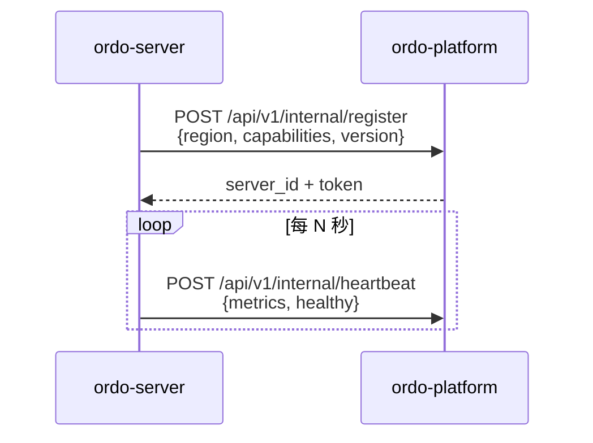
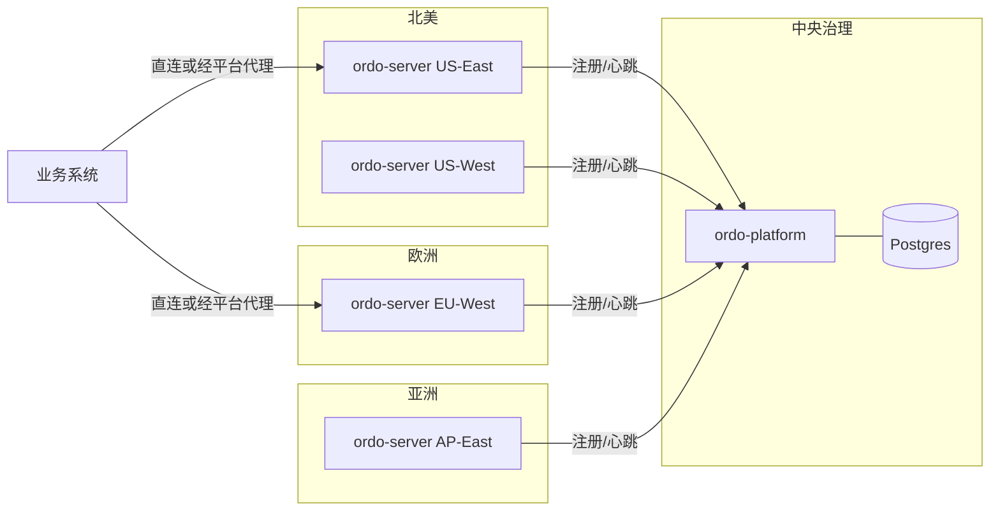

# 服务器注册与多区域

平台和执行节点之间是松耦合的。`ordo-server` 实例启动后主动向平台注册，平台维护一份服务器目录，用于发布与代理。

## 注册流程


```mermaid
sequenceDiagram
  participant Server as ordo-server
  participant Platform as ordo-platform

  Server->>Platform: POST /api/v1/internal/register<br/>{region, capabilities, version}
  Platform-->>Server: server_id + token
  loop 每 N 秒
    Server->>Platform: POST /api/v1/internal/heartbeat<br/>{metrics, healthy}
  end
```

> `/api/v1/internal/*` 是机器对机器端点，使用 server token 鉴权，不暴露给浏览器或 SDK。

## 组织接入令牌（Connect Token）

引擎属于哪个组织，由它注册时携带的令牌决定。为某个组织生成一个**接入令牌**并配置到该组织的引擎上，引擎就会注册到这个组织，而不是进入所有人可见的全局池。

```http
POST   /api/v1/orgs/:oid/connect-tokens      # 铸造(原始令牌只返回这一次)
GET    /api/v1/orgs/:oid/connect-tokens      # 列出元数据(从不返回原始令牌)
DELETE /api/v1/orgs/:oid/connect-tokens/:id  # 吊销
```

通过 flag 或环境变量把令牌传给引擎：

```bash
ordo-server --platform-connect-token ordo_connect_xxxx，或
ORDO_CONNECT_TOKEN=ordo_connect_xxxx ordo-server
```

引擎注册时把令牌放在 `x-connect-token` 头中发送，平台据此确定归属组织，并把该服务器记在这个组织名下。令牌既用于授权注册，也决定归属。在按组织划分的部署里，它取代全局的 `--platform-registration-secret`。

效果：

- [服务器目录](#服务器目录)和[项目绑定](#项目绑定)选择器只显示注册到你所属组织的引擎。
- 项目只能绑定本组织的引擎，绑定其他组织的服务器会被拒绝。
- 吊销令牌后，使用它的新注册会失败；已注册的服务器保留原归属（要移除就删除该服务器）。

> 升级已有引擎：在引入接入令牌之前（或未带令牌）注册的引擎没有组织归属，不会出现在任何组织下。生成一个令牌，设置 `ORDO_CONNECT_TOKEN` 并重启引擎，它会重新注册到该组织。

## 服务器目录

| 操作 | 端点                              |
| ---- | --------------------------------- |
| 列出 | `GET /api/v1/servers`             |
| 详情 | `GET /api/v1/servers/:id`         |
| 健康 | `GET /api/v1/servers/:id/health`  |
| 指标 | `GET /api/v1/servers/:id/metrics` |
| 注销 | `DELETE /api/v1/servers/:id`      |

服务器记录字段：

- `region`：部署区域标签
- `capabilities`：启用的能力（如 `jit`、`signature`）
- `healthy` / `last_heartbeat`
- `current_rulesets`：当前持有的规则集摘要

## 项目绑定

每个项目可以绑定一个或多个服务器（可按环境分别绑定）。绑定决定：

1. 发布时把规则推到哪些 ordo-server。
2. 业务请求经过平台代理时路由到哪个集群。

```http
PUT /api/v1/orgs/:oid/projects/:pid/server
{ "environment": "prod", "server_ids": ["s_eu", "s_us"] }
```

## 执行代理

业务系统不一定能直连区域内的 ordo-server，因此平台提供一个透传代理：

```http
POST /api/v1/engine/:project_id/execute
```

请求会路由到该项目当前环境绑定的 ordo-server，并保留原始 latency 指标（平台只转发，不解析）。

适用场景：

- 业务方只能访问公网平台域名。
- 多区域容灾：平台按健康状态路由，故障时切到备份服务器。
- 灰度切流：灰度发布阶段，平台按比例把请求分发到新旧版本的服务器。

## 多区域部署示例


```mermaid
flowchart LR
  subgraph 中央["中央治理"]
    P[ordo-platform]
    DB[(Postgres)]
    P --- DB
  end
  subgraph 北美
    S1[ordo-server US-East]
    S2[ordo-server US-West]
  end
  subgraph 欧洲
    S3[ordo-server EU-West]
  end
  subgraph 亚洲
    S4[ordo-server AP-East]
  end

  S1 -- 注册/心跳 --> P
  S2 -- 注册/心跳 --> P
  S3 -- 注册/心跳 --> P
  S4 -- 注册/心跳 --> P

  Biz["业务系统"] -- 直连或经平台代理 --> S1
  Biz -- 直连或经平台代理 --> S3
```
